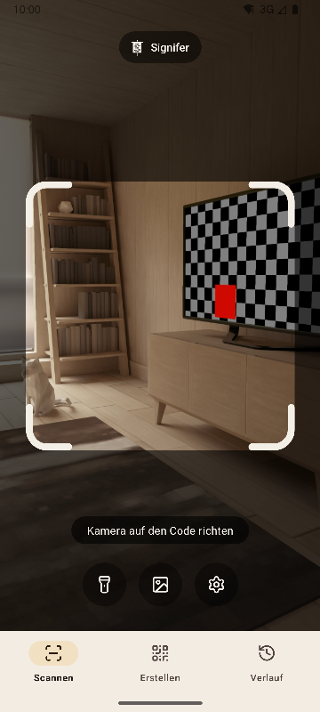
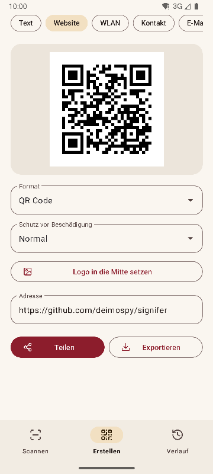
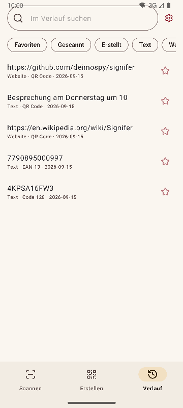
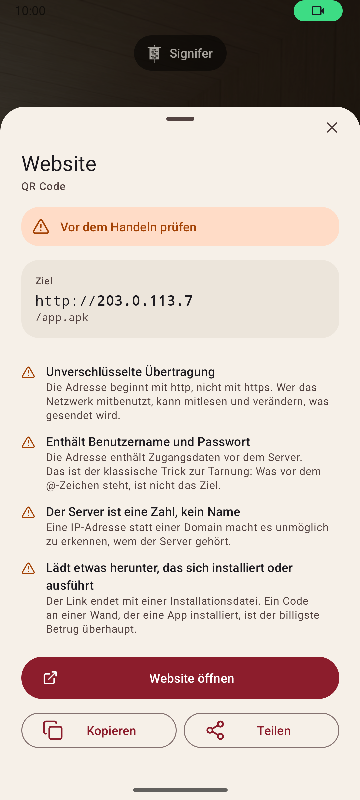

# Signifer

[English](README.md) · [Español](README.es.md) · [Português](README.pt.md) · **Deutsch** · [Français](README.fr.md) · [Italiano](README.it.md) · [Nederlands](README.nl.md) · [Polski](README.pl.md) · [Türkçe](README.tr.md) · [Suomi](README.fi.md) · [日本語](README.ja.md) · [한국어](README.ko.md) · [简体中文](README.zh-CN.md) · [繁體中文](README.zh-TW.md)


QR-Code- und Barcode-Scanner und -Generator für Android. Liest 20 Codearten, erstellt 13 und warnt vor verdächtigen Links. Vollständig, schnell und leicht.

*Signifer* war der Feldzeichenträger der römischen Legion: der, der das **Signum** trug, das Zeichen, dem die anderen folgten. Ein Codeleser tut dasselbe: Er nimmt ein Zeichen, das niemand mit bloßem Auge lesen kann, und macht es sichtbar.

| Scannen | Erstellen | Verlauf | Ergebnis |
|---|---|---|---|
|  |  |  |  |

## Was sie auszeichnet

- **Warnt vor verdächtigen Links, bevor sie geöffnet werden.** Schemata werden gegen eine geschlossene Liste geprüft, dazu Punycode und gemischte Alphabete, eingebettete Zugangsdaten, private Netzwerke, Kurzlinks, Downloads von Installationsdateien und Zeichen, die Text umkehren. Der Server wird so aufgelöst wie im Browser, daher wird `2130706433` als das Telefon selbst erkannt. Jeder Befund wird erklärt, nicht nur eingefärbt.
- **Öffnet nie etwas von selbst.** Jede Aktion erfordert ein Tippen, und das Ziel wird beim Tippen erneut geprüft.
- **Kein Netzwerk.** Die Berechtigung `INTERNET` ist nicht deklariert, daher verhindert das System jede Verbindung. Geprüft am kompilierten Binärpaket, siehe [docs/AUDITORIA.md](docs/AUDITORIA.md).
- **Keine Werbung, keine Käufe, kein Tracking.** Die Prüfung sucht im Binärpaket nach Spuren der gängigsten Analyse- und Werbe-SDKs. Keine taucht auf.
- **Keine Speicherberechtigungen.** Bilder kommen über die Bildauswahl des Systems, die nur das gewählte Bild übergibt. Die einzigen Berechtigungen sind Kamera und Vibration.
- **Sensible Inhalte werden nicht automatisch gespeichert.** Ein WLAN-Passwort landet nur im Verlauf, wenn du es auf dem Ergebnisbildschirm ausdrücklich speicherst.
- **Open Source** unter Apache-2.0.

## Scannen

- Liest nur, was im Rahmen liegt, und füllt den gelesenen Code grün, damit klar ist, welcher es war, wenn mehrere zu sehen sind.
- Schmale, lange Etiketten wie die Seriennummern auf Festplatten.
- Zoom per Fingergeste oder Doppeltippen, Fokus auf die angetippte Stelle.
- Taschenlampe, Lesen aus einem Bild, Vibration und Ton optional.
- Erkennungsrate gemessen an 225 schwierigen Bildern, siehe [docs/RENDIMIENTO.md](docs/RENDIMIENTO.md).

## Formate

**Lesen (20)**

Matrixcodes: `QR_CODE` · `MICRO_QR_CODE` · `RMQR_CODE` · `DATA_MATRIX` · `AZTEC` · `MAXICODE`

Handel: `EAN_8` · `EAN_13` · `UPC_A` · `UPC_E` · `DATA_BAR` · `DATA_BAR_EXPANDED` · `DATA_BAR_LIMITED`

Industrie und Logistik: `CODE_39` · `CODE_93` · `CODE_128` · `ITF` · `CODABAR` · `PDF_417` · `DX_FILM_EDGE`

**Erstellen (13)**

`QR_CODE` · `DATA_MATRIX` · `AZTEC` · `PDF_417` · `CODE_128` · `CODE_39` · `CODE_93` · `EAN_13` · `EAN_8` · `UPC_A` · `UPC_E` · `ITF` · `CODABAR`

Neun Inhaltstypen: Text, Website, WLAN, Kontakt (vCard 3.0), E-Mail, Telefon, SMS, Standort und Termin (iCalendar). Live-Vorschau, optionales Logo in der Mitte und Export als PNG und SVG. Der Inhalt wird vor dem Erzeugen gegen das Format geprüft, und ein Code mit zu wenig Kontrast wird nicht exportiert.

## Sprachen

Englisch, Spanisch, Portugiesisch, Deutsch, Französisch, Italienisch, Niederländisch, Polnisch, Türkisch, Finnisch, Japanisch, Koreanisch, vereinfachtes Chinesisch und traditionelles Chinesisch (Taiwan). Die App folgt der Sprache des Telefons; eine andere lässt sich in den Einstellungen wählen.

## Systemintegration

- Kachel in den Schnelleinstellungen, um zu scannen, ohne die App-Übersicht zu öffnen.
- Verknüpfungen am App-Symbol zu den drei Bereichen.
- Reagiert auf den klassischen ZXing-Intent: Andere Apps fordern einen Scan an und erhalten das Ergebnis, ohne die Oberfläche zu sehen.
- Nimmt Bilder an, die aus der Galerie oder dem Browser geteilt werden.

## Bauen

Benötigt JDK 17 und das Android SDK 36.

```
./gradlew :app:assembleRelease
```

Das Ergebnis ist ein Paket pro Architektur. Ein Telefon installiert nur seins.

## Prüfen

```
./gradlew :app:testDebugUnitTest         # Unit-Tests, ohne Emulator
./gradlew :app:lintRelease               # statische Analyse mit Warnungen als Fehler
./gradlew :app:connectedDebugAndroidTest # Tests auf dem Gerät
python tools/check_purity.py             # die Domäne importiert kein Android, keine unsichtbaren Zeichen
python tools/measure.py                  # Größe gegen die Obergrenze des Projekts
python tools/audit.py                    # Berechtigungen und Spuren im Binärpaket
python tools/screenshots.py              # Screenshots für diese Dokumente, mit angeschlossenem Emulator
```

## Dokumentation

Die technischen Dokumente sind auf Spanisch.

| Dokument | Inhalt |
|---|---|
| [MEDICIONES.md](docs/MEDICIONES.md) | Größe Commit für Commit und was sie verändert hat |
| [RENDIMIENTO.md](docs/RENDIMIENTO.md) | Erkennungsrate, Zeiten und Start |
| [AUDITORIA.md](docs/AUDITORIA.md) | Was im veröffentlichten Binärpaket steckt |
| [DECISIONES.md](docs/DECISIONES.md) | Die offenen Entscheidungen und wie sie getroffen wurden |
| [marca/](docs/marca) | Das Feldzeichen als SVG |

## Signifer unterstützen

Signifer ist kostenlos, ohne Werbung und ohne Tracking. Wenn es dir nützt, kannst du die Entwicklung unterstützen:

[](https://github.com/sponsors/deimospy)
[](https://buymeacoffee.com/deimospy)

## Lizenz

Apache License 2.0. Siehe [LICENSE](LICENSE).
