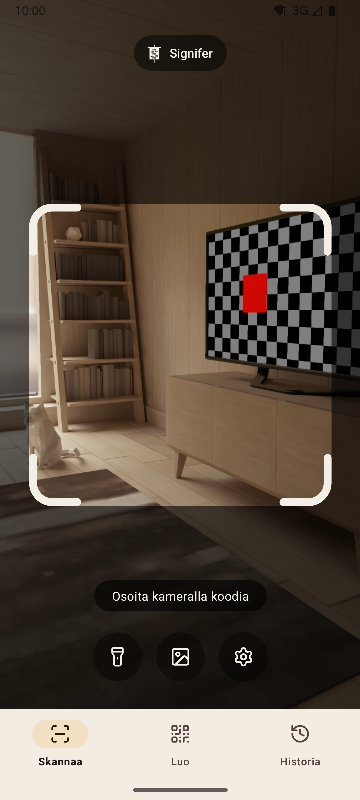
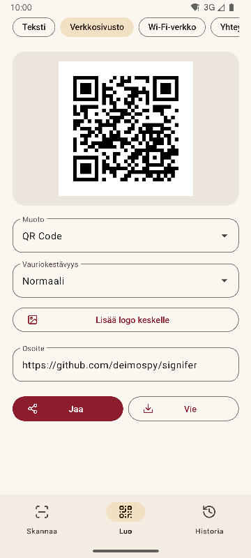
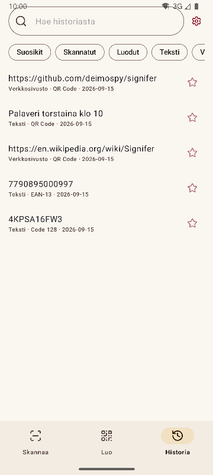
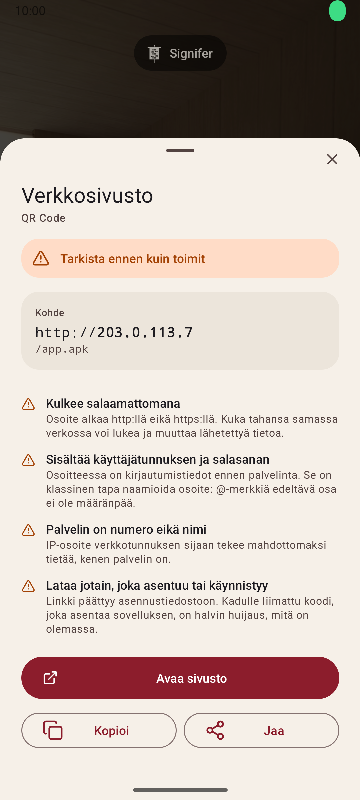

# Signifer

[English](README.md) · [Español](README.es.md) · [Português](README.pt.md) · [Deutsch](README.de.md) · [Français](README.fr.md) · [Italiano](README.it.md) · [Nederlands](README.nl.md) · [Polski](README.pl.md) · [Türkçe](README.tr.md) · **Suomi** · [日本語](README.ja.md) · [한국어](README.ko.md) · [简体中文](README.zh-CN.md) · [繁體中文](README.zh-TW.md)


QR- ja viivakoodien lukija ja luoja Androidille. Lukee 20 koodityyppiä, luo 13 ja varoittaa epäilyttävistä linkeistä. Kattava, nopea ja kevyt.

*Signifer* oli roomalaisen legioonan lipunkantaja: se, joka kantoi **signumia**, merkkiä jota muut seurasivat. Koodinlukija tekee saman: se ottaa merkin, jota kukaan ei pysty lukemaan paljain silmin, ja näyttää sen.

| Skannaa | Luo | Historia | Tulos |
|---|---|---|---|
|  |  |  |  |

## Mikä tekee siitä erilaisen

- **Varoittaa epäilyttävistä linkeistä ennen avaamista.** Skeemat tarkistetaan suljettua listaa vasten, samoin punycode ja sekoitetut aakkostot, upotetut kirjautumistiedot, yksityiset verkot, lyhytlinkit, asennustiedostojen lataukset ja tekstin kääntävät merkit. Palvelin selvitetään samoin kuin selain sen selvittää, joten `2130706433` tunnistetaan puhelimen omaksi osoitteeksi. Jokainen havainto selitetään, ei vain väritetä.
- **Ei koskaan avaa mitään itsestään.** Jokainen toiminto vaatii napautuksen, ja kohde tarkistetaan uudelleen napautushetkellä.
- **Ei verkkoa.** `INTERNET`-lupaa ei ole määritelty, joten järjestelmä estää kaikki yhteydet. Tarkistettu käännetystä paketista, katso [docs/AUDITORIA.md](docs/AUDITORIA.md).
- **Ei mainoksia, ostoja eikä seurantaa.** Tarkastus etsii paketista yleisimpien analytiikka- ja mainos-SDK:iden jälkiä. Yhtään ei löydy.
- **Ei tallennustilan lupia.** Kuvat tulevat järjestelmän valitsimen kautta, joka luovuttaa vain valitun kuvan. Ainoat luvat ovat kamera ja värinä.
- **Arkaluonteinen sisältö jää automaattisen tallennuksen ulkopuolelle.** Wi-Fi-salasana tallentuu historiaan vain, jos pyydät sitä tulosnäkymässä.
- **Avoin lähdekoodi** Apache-2.0-lisenssillä.

## Lukeminen

- Lukee vain kehyksen sisällä olevan ja täyttää luetun koodin vihreällä, jotta tiedät, mikä se oli, kun näkyvissä on useita.
- Kapeat ja pitkät tarrat, kuten kiintolevyjen sarjanumerot.
- Zoomaus nipistämällä tai kaksoisnapautuksella ja tarkennus napautettuun kohtaan.
- Taskulamppu, lukeminen kuvasta, valinnainen värinä ja ääni.
- Tunnistustarkkuus mitattu 225 vaikean kuvan joukolla, katso [docs/RENDIMIENTO.md](docs/RENDIMIENTO.md).

## Muodot

**Lukeminen (20)**

Matriisikoodit: `QR_CODE` · `MICRO_QR_CODE` · `RMQR_CODE` · `DATA_MATRIX` · `AZTEC` · `MAXICODE`

Kauppa: `EAN_8` · `EAN_13` · `UPC_A` · `UPC_E` · `DATA_BAR` · `DATA_BAR_EXPANDED` · `DATA_BAR_LIMITED`

Teollisuus ja logistiikka: `CODE_39` · `CODE_93` · `CODE_128` · `ITF` · `CODABAR` · `PDF_417` · `DX_FILM_EDGE`

**Luominen (13)**

`QR_CODE` · `DATA_MATRIX` · `AZTEC` · `PDF_417` · `CODE_128` · `CODE_39` · `CODE_93` · `EAN_13` · `EAN_8` · `UPC_A` · `UPC_E` · `ITF` · `CODABAR`

Yhdeksän sisältötyyppiä: teksti, verkkosivusto, Wi-Fi, yhteystieto (vCard 3.0), sähköposti, puhelin, tekstiviesti, sijainti ja tapahtuma (iCalendar). Reaaliaikainen esikatselu, valinnainen logo keskellä sekä vienti PNG- ja SVG-muotoon. Sisältö tarkistetaan muotoa vasten ennen luomista, eikä liian heikkokontrastista koodia viedä.

## Kielet

Englanti, espanja, portugali, saksa, ranska, italia, hollanti, puola, turkki, suomi, japani, korea, yksinkertaistettu kiina ja perinteinen kiina (Taiwan). Sovellus käyttää puhelimen kieltä, ja asetuksista voi valita toisen.

## Järjestelmäintegraatio

- Pika-asetusten ruutu, jolla voi skannata avaamatta sovelluslistaa.
- Kuvakkeen pikakuvakkeet kolmeen osioon.
- Vastaa ZXingin perinteiseen intentiin: muut sovellukset pyytävät lukua ja saavat tuloksen näkemättä käyttöliittymää.
- Hyväksyy galleriasta tai selaimesta jaetut kuvat.

## Kääntäminen

Vaatii JDK 17:n ja Android SDK 36:n.

```
./gradlew :app:assembleRelease
```

Tuloksena on yksi paketti arkkitehtuuria kohden. Puhelin asentaa vain omansa.

## Tarkistukset

```
./gradlew :app:testDebugUnitTest         # yksikkötestit, ilman emulaattoria
./gradlew :app:lintRelease               # staattinen analyysi, varoitukset virheinä
./gradlew :app:connectedDebugAndroidTest # testit laitteella
python tools/check_purity.py             # toimialueen koodi ei tuo Androidia, ei näkymättömiä merkkejä
python tools/measure.py                  # koko projektin ylärajaa vasten
python tools/audit.py                    # paketin luvat ja jäljet
python tools/screenshots.py              # näiden dokumenttien kuvakaappaukset, emulaattori yhdistettynä
```

## Dokumentaatio

Tekniset dokumentit ovat espanjaksi.

| Dokumentti | Sisältö |
|---|---|
| [MEDICIONES.md](docs/MEDICIONES.md) | Koko commit kerrallaan ja mikä sitä muutti |
| [RENDIMIENTO.md](docs/RENDIMIENTO.md) | Tunnistustarkkuus, ajat ja käynnistys |
| [AUDITORIA.md](docs/AUDITORIA.md) | Mitä julkaistun paketin sisällä on |
| [DECISIONES.md](docs/DECISIONES.md) | Avoimet päätökset ja miten ne tehtiin |
| [marca/](docs/marca) | Lippu SVG-muodossa |

## Tue Signiferiä

Signifer on ilmainen, eikä siinä ole mainoksia tai seurantaa. Jos siitä on sinulle hyötyä, voit tukea sen kehitystä:

[](https://github.com/sponsors/deimospy)
[](https://buymeacoffee.com/deimospy)

## Lisenssi

Apache License 2.0. Katso [LICENSE](LICENSE).
