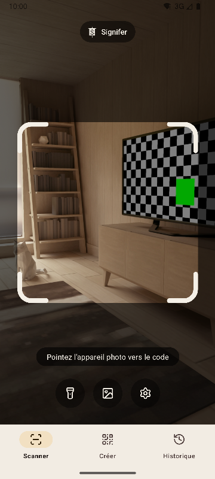
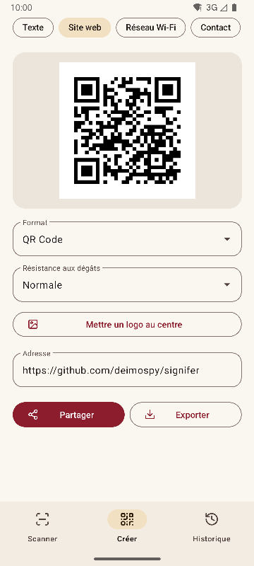
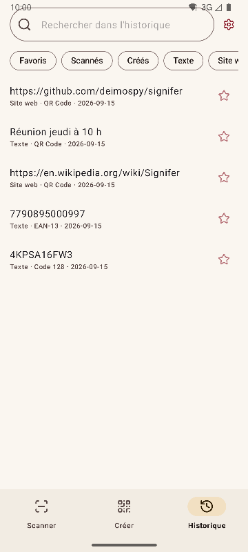
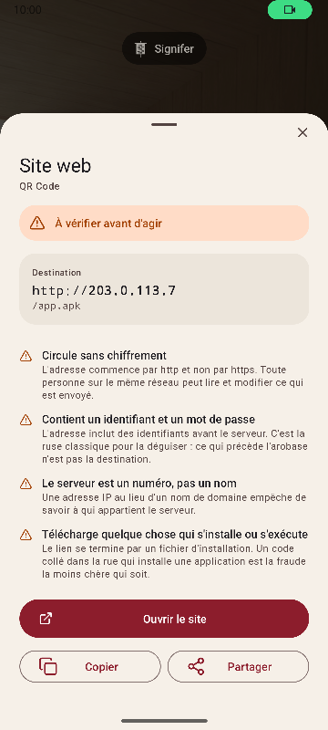

# Signifer

[English](README.md) · [Español](README.es.md) · [Português](README.pt.md) · [Deutsch](README.de.md) · **Français** · [Italiano](README.it.md) · [Nederlands](README.nl.md) · [Polski](README.pl.md) · [Türkçe](README.tr.md) · [Suomi](README.fi.md) · [日本語](README.ja.md) · [한국어](README.ko.md) · [简体中文](README.zh-CN.md) · [繁體中文](README.zh-TW.md)


Lecteur et générateur de codes QR et de codes-barres pour Android. Lit 20 types de codes, en crée 13 et signale les liens suspects. Complète, rapide et légère.

*Signifer* était le porte-enseigne de la légion romaine : celui qui portait le **signum**, le signe que les autres suivaient. Un lecteur de codes fait de même : il prend un signe que personne ne peut lire à l'œil nu et le révèle.

| Lire | Créer | Historique | Résultat |
|---|---|---|---|
|  |  |  |  |

## Ce qui la distingue

- **Signale les liens suspects avant de les ouvrir.** Schémas vérifiés contre une liste fermée, punycode et mélange d'alphabets, identifiants intégrés, réseaux privés, raccourcisseurs, téléchargements de fichiers d'installation et caractères qui inversent le texte. Le serveur est résolu comme le fait le navigateur, si bien que `2130706433` est reconnu comme le téléphone lui-même. Chaque alerte est expliquée, pas seulement colorée.
- **N'ouvre jamais rien d'elle-même.** Chaque action demande un appui, et la destination est analysée de nouveau au moment de l'appui.
- **Sans réseau.** L'autorisation `INTERNET` n'est pas déclarée, le système bloque donc toute connexion. Vérifié sur le binaire compilé, voir [docs/AUDITORIA.md](docs/AUDITORIA.md).
- **Sans publicité, sans achats et sans pistage.** L'audit cherche dans le binaire les traces des SDK d'analyse et de publicité les plus courants. Aucune n'apparaît.
- **Aucune autorisation de stockage.** Les images arrivent par le sélecteur du système, qui ne transmet que celle choisie. Les seules autorisations sont l'appareil photo et la vibration.
- **Contenu sensible exclu de l'enregistrement automatique.** Un mot de passe Wi-Fi n'est enregistré dans l'historique que si vous le demandez sur l'écran du résultat.
- **Open source** sous licence Apache-2.0.

## Lecture

- Ne lit que ce qui se trouve dans le cadre et remplit de vert le code lu, pour savoir lequel c'était quand plusieurs sont visibles.
- Étiquettes fines et longues, comme les numéros de série des disques durs.
- Zoom par pincement ou double appui, et mise au point à l'endroit touché.
- Lampe torche, lecture depuis une image, vibration et son en option.
- Taux de détection mesuré sur un ensemble de 225 images difficiles, voir [docs/RENDIMIENTO.md](docs/RENDIMIENTO.md).

## Formats

**Lecture (20)**

Matriciels : `QR_CODE` · `MICRO_QR_CODE` · `RMQR_CODE` · `DATA_MATRIX` · `AZTEC` · `MAXICODE`

Commerce : `EAN_8` · `EAN_13` · `UPC_A` · `UPC_E` · `DATA_BAR` · `DATA_BAR_EXPANDED` · `DATA_BAR_LIMITED`

Industrie et logistique : `CODE_39` · `CODE_93` · `CODE_128` · `ITF` · `CODABAR` · `PDF_417` · `DX_FILM_EDGE`

**Création (13)**

`QR_CODE` · `DATA_MATRIX` · `AZTEC` · `PDF_417` · `CODE_128` · `CODE_39` · `CODE_93` · `EAN_13` · `EAN_8` · `UPC_A` · `UPC_E` · `ITF` · `CODABAR`

Neuf types de contenu : texte, site web, Wi-Fi, contact (vCard 3.0), e-mail, téléphone, SMS, lieu et événement (iCalendar). Aperçu en direct, logo facultatif au centre et export en PNG et SVG. Le contenu est vérifié par rapport au format avant la génération, et un code trop peu contrasté n'est pas exporté.

## Langues

Anglais, espagnol, portugais, allemand, français, italien, néerlandais, polonais, turc, finnois, japonais, coréen, chinois simplifié et chinois de Taïwan. L'application suit la langue du téléphone, et une autre peut être choisie dans les paramètres.

## Intégration au système

- Tuile dans les réglages rapides, pour scanner sans ouvrir la liste des applications.
- Raccourcis sur l'icône vers les trois sections.
- Répond à l'intent historique de ZXing : d'autres applications demandent une lecture et reçoivent le résultat sans voir l'interface.
- Accepte les images partagées depuis la galerie ou le navigateur.

## Compiler

Nécessite le JDK 17 et le SDK Android 36.

```
./gradlew :app:assembleRelease
```

Le résultat est un paquet par architecture. Un téléphone n'installe que le sien.

## Vérifier

```
./gradlew :app:testDebugUnitTest         # tests unitaires, sans émulateur
./gradlew :app:lintRelease               # analyse statique, avertissements traités comme des erreurs
./gradlew :app:connectedDebugAndroidTest # tests sur appareil
python tools/check_purity.py             # le domaine n'importe pas Android, aucun caractère invisible
python tools/measure.py                  # taille par rapport au plafond du projet
python tools/audit.py                    # autorisations et traces dans le binaire
python tools/screenshots.py              # captures de ces documents, avec un émulateur connecté
```

## Documentation

Les documents techniques sont en espagnol.

| Document | Contenu |
|---|---|
| [MEDICIONES.md](docs/MEDICIONES.md) | Taille commit par commit et ce qui l'a fait varier |
| [RENDIMIENTO.md](docs/RENDIMIENTO.md) | Taux de détection, temps et démarrage |
| [AUDITORIA.md](docs/AUDITORIA.md) | Ce que contient le binaire publié |
| [DECISIONES.md](docs/DECISIONES.md) | Les décisions ouvertes et comment elles ont été tranchées |
| [marca/](docs/marca) | L'enseigne en SVG |

## Soutenir Signifer

Signifer est gratuite, sans publicité et sans pistage. Si elle vous est utile, vous pouvez soutenir son développement :

[](https://github.com/sponsors/deimospy)
[](https://buymeacoffee.com/deimospy)

## Licence

Apache License 2.0. Voir [LICENSE](LICENSE).
