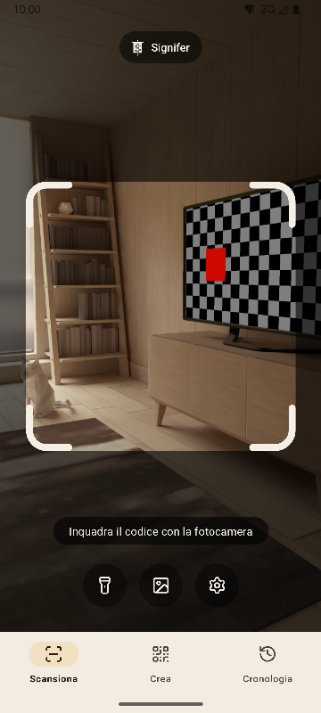
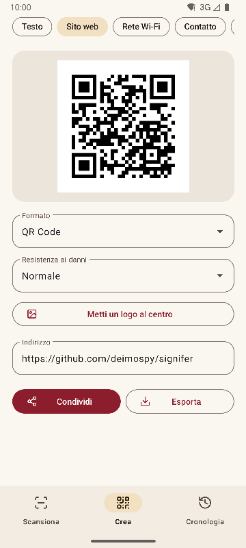
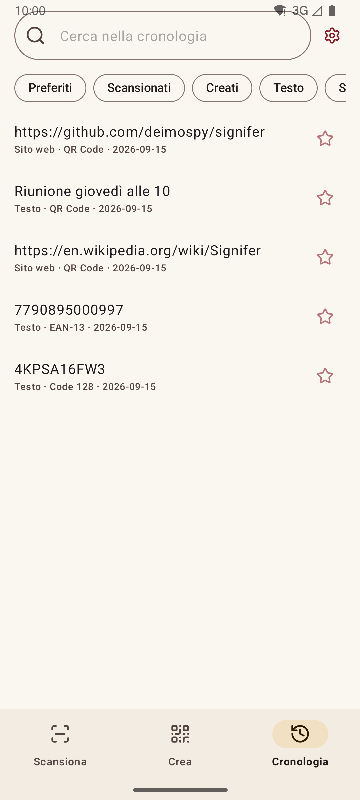
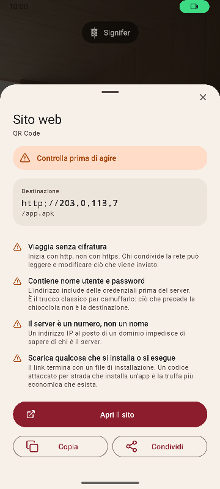

# Signifer

[English](README.md) · [Español](README.es.md) · [Português](README.pt.md) · [Deutsch](README.de.md) · [Français](README.fr.md) · **Italiano** · [Nederlands](README.nl.md) · [Polski](README.pl.md) · [Türkçe](README.tr.md) · [Suomi](README.fi.md) · [日本語](README.ja.md) · [한국어](README.ko.md) · [简体中文](README.zh-CN.md) · [繁體中文](README.zh-TW.md)


Lettore e generatore di codici QR e a barre per Android. Legge 20 tipi di codici, ne crea 13 e avvisa dei link sospetti. Completa, veloce e leggera.

*Signifer* era il portainsegne della legione romana: colui che portava il **signum**, il segno che gli altri seguivano. Un lettore di codici fa lo stesso: prende un segno che nessuno riesce a leggere a occhio nudo e lo mostra.

| Scansiona | Crea | Cronologia | Risultato |
|---|---|---|---|
|  |  |  |  |

## Cosa la distingue

- **Avvisa dei link sospetti prima di aprirli.** Schemi verificati contro un elenco chiuso, punycode e alfabeti misti, credenziali incorporate, reti private, link accorciati, download di file di installazione e caratteri che invertono il testo. Il server viene risolto come fa il browser, quindi `2130706433` viene riconosciuto come il telefono stesso. Ogni segnalazione è spiegata, non solo colorata.
- **Non apre mai nulla da sola.** Ogni azione richiede un tocco, e la destinazione viene analizzata di nuovo al momento del tocco.
- **Senza rete.** Il permesso `INTERNET` non è dichiarato, quindi il sistema blocca qualsiasi connessione. Verificato sul binario compilato, vedi [docs/AUDITORIA.md](docs/AUDITORIA.md).
- **Niente pubblicità, acquisti o tracciamento.** L'audit cerca nel binario le tracce degli SDK di analisi e pubblicità più comuni. Non ne compare nessuna.
- **Nessun permesso di archiviazione.** Le immagini arrivano dal selettore di sistema, che consegna solo quella scelta. Gli unici permessi sono fotocamera e vibrazione.
- **Contenuti sensibili esclusi dal salvataggio automatico.** Una password Wi-Fi non viene salvata nella cronologia a meno che tu non lo chieda nella schermata del risultato.
- **Open source** con licenza Apache-2.0.

## Lettura

- Legge solo ciò che è dentro la cornice e riempie di verde il codice letto, per capire quale è stato quando ce ne sono diversi in vista.
- Etichette sottili e lunghe, come i numeri di serie dei dischi rigidi.
- Zoom con pizzico o doppio tocco, e messa a fuoco nel punto toccato.
- Torcia, lettura da un'immagine, vibrazione e suono opzionali.
- Tasso di rilevamento misurato su un insieme di 225 immagini difficili, vedi [docs/RENDIMIENTO.md](docs/RENDIMIENTO.md).

## Formati

**Lettura (20)**

Matriciali: `QR_CODE` · `MICRO_QR_CODE` · `RMQR_CODE` · `DATA_MATRIX` · `AZTEC` · `MAXICODE`

Commercio: `EAN_8` · `EAN_13` · `UPC_A` · `UPC_E` · `DATA_BAR` · `DATA_BAR_EXPANDED` · `DATA_BAR_LIMITED`

Industria e logistica: `CODE_39` · `CODE_93` · `CODE_128` · `ITF` · `CODABAR` · `PDF_417` · `DX_FILM_EDGE`

**Creazione (13)**

`QR_CODE` · `DATA_MATRIX` · `AZTEC` · `PDF_417` · `CODE_128` · `CODE_39` · `CODE_93` · `EAN_13` · `EAN_8` · `UPC_A` · `UPC_E` · `ITF` · `CODABAR`

Nove tipi di contenuto: testo, sito web, Wi-Fi, contatto (vCard 3.0), email, telefono, SMS, posizione ed evento (iCalendar). Anteprima dal vivo, logo opzionale al centro ed esportazione in PNG e SVG. Il contenuto viene verificato rispetto al formato prima di generare, e un codice con poco contrasto non viene esportato.

## Lingue

Inglese, spagnolo, portoghese, tedesco, francese, italiano, olandese, polacco, turco, finlandese, giapponese, coreano, cinese semplificato e cinese di Taiwan. Segue la lingua del telefono, e se ne può scegliere un'altra nelle impostazioni.

## Integrazione con il sistema

- Riquadro nelle impostazioni rapide, per scansionare senza aprire l'elenco delle app.
- Scorciatoie sull'icona verso le tre sezioni.
- Risponde all'intent storico di ZXing: altre app chiedono una lettura e ricevono il risultato senza vedere l'interfaccia.
- Accetta immagini condivise dalla galleria o dal browser.

## Compilare

Richiede JDK 17 e l'SDK Android 36.

```
./gradlew :app:assembleRelease
```

Il risultato è un pacchetto per architettura. Un telefono installa solo il suo.

## Verificare

```
./gradlew :app:testDebugUnitTest         # test unitari, senza emulatore
./gradlew :app:lintRelease               # analisi statica con avvisi trattati come errori
./gradlew :app:connectedDebugAndroidTest # test sul dispositivo
python tools/check_purity.py             # il dominio non importa Android, nessun carattere invisibile
python tools/measure.py                  # dimensione rispetto al limite del progetto
python tools/audit.py                    # permessi e tracce nel binario
python tools/screenshots.py              # screenshot di questi documenti, con un emulatore collegato
```

## Documentazione

I documenti tecnici sono in spagnolo.

| Documento | Contenuto |
|---|---|
| [MEDICIONES.md](docs/MEDICIONES.md) | Dimensione commit per commit e cosa l'ha cambiata |
| [RENDIMIENTO.md](docs/RENDIMIENTO.md) | Tasso di rilevamento, tempi e avvio |
| [AUDITORIA.md](docs/AUDITORIA.md) | Cosa c'è nel binario pubblicato |
| [DECISIONES.md](docs/DECISIONES.md) | Le decisioni aperte e come sono state prese |
| [marca/](docs/marca) | Lo stendardo in SVG |

## Sostieni Signifer

Signifer è gratuita, senza pubblicità e senza tracciamento. Se ti è utile, puoi sostenerne lo sviluppo:

[](https://github.com/sponsors/deimospy)
[](https://buymeacoffee.com/deimospy)

## Licenza

Apache License 2.0. Vedi [LICENSE](LICENSE).
