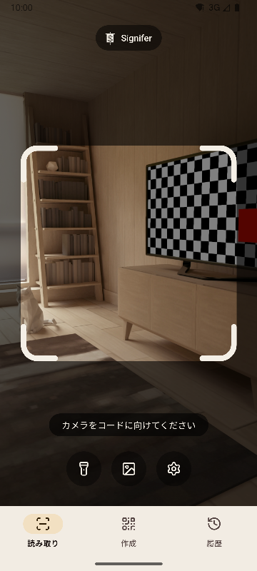
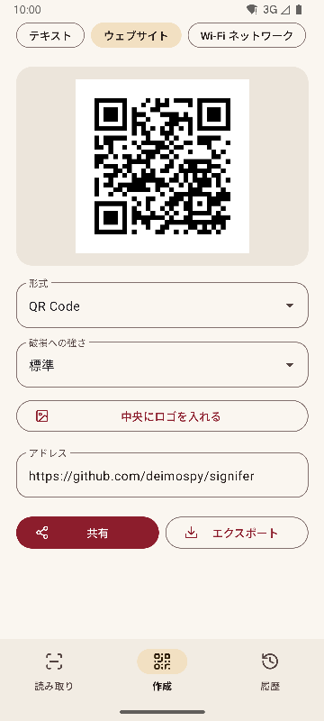
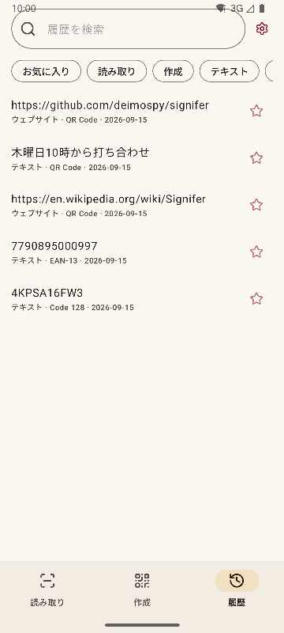
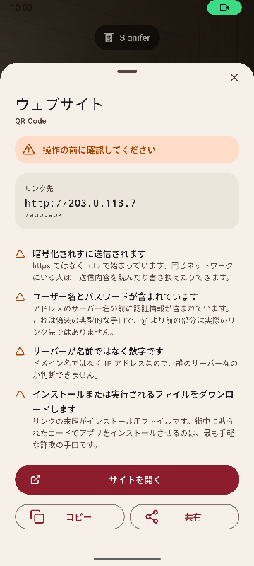

# Signifer

[English](README.md) · [Español](README.es.md) · [Português](README.pt.md) · [Deutsch](README.de.md) · [Français](README.fr.md) · [Italiano](README.it.md) · [Nederlands](README.nl.md) · [Polski](README.pl.md) · [Türkçe](README.tr.md) · [Suomi](README.fi.md) · **日本語** · [한국어](README.ko.md) · [简体中文](README.zh-CN.md) · [繁體中文](README.zh-TW.md)


Android 向けの QR コード・バーコードの読み取り／作成アプリ。20 種類のコードを読み取り、13 種類を作成し、不審なリンクを警告します。多機能で、速く、軽量です。

*Signifer* とは、ローマ軍団の旗手のことです。ほかの兵士が従う印、**signum** を掲げる者でした。コードリーダーも同じことをします。肉眼では読めない印を受け取り、それを見せるのです。

| 読み取り | 作成 | 履歴 | 結果 |
|---|---|---|---|
|  |  |  |  |

## ほかとの違い

- **不審なリンクを開く前に警告します。** 固定された一覧によるスキームの確認に加え、Punycode や文字体系の混在、埋め込まれた認証情報、プライベートネットワーク、短縮 URL、インストール用ファイルのダウンロード、文字の並びを反転させる文字をチェックします。サーバーはブラウザと同じ方法で解釈するため、`2130706433` は端末自身として認識されます。検出内容は色分けだけでなく、理由も説明します。
- **勝手に何かを開くことはありません。** どの操作もタップが必要で、タップした時点でリンク先をもう一度分析します。
- **ネットワークを使いません。** `INTERNET` 権限を宣言していないため、システムがあらゆる通信を遮断します。コンパイル済みのパッケージで確認しています。詳しくは [docs/AUDITORIA.md](docs/AUDITORIA.md) をご覧ください。
- **広告、課金、トラッキングはありません。** 監査では、一般的な分析・広告 SDK の痕跡をパッケージ内から探しますが、何も見つかりません。
- **ストレージの権限は不要です。** 画像はシステムの選択画面から、選んだものだけが渡されます。権限はカメラとバイブレーションのみです。
- **機密性の高い内容は自動保存しません。** Wi-Fi のパスワードは、結果画面で保存を選んだ場合にのみ履歴に残ります。
- Apache-2.0 ライセンスの**オープンソース**です。

## 読み取り

- 枠の中にあるものだけを読み取り、読み取ったコードを緑色で塗りつぶします。複数のコードが写っていても、どれを読んだかがわかります。
- ハードディスクのシリアル番号のような、細長いラベルにも対応しています。
- ピンチ操作やダブルタップでズームし、タップした場所にピントを合わせます。
- ライト、画像からの読み取り、バイブレーションと音（オプション）。
- 225 枚の難しい画像で検出率を測定しています。詳しくは [docs/RENDIMIENTO.md](docs/RENDIMIENTO.md) をご覧ください。

## 対応形式

**読み取り（20）**

マトリックス型： `QR_CODE` · `MICRO_QR_CODE` · `RMQR_CODE` · `DATA_MATRIX` · `AZTEC` · `MAXICODE`

小売： `EAN_8` · `EAN_13` · `UPC_A` · `UPC_E` · `DATA_BAR` · `DATA_BAR_EXPANDED` · `DATA_BAR_LIMITED`

産業・物流： `CODE_39` · `CODE_93` · `CODE_128` · `ITF` · `CODABAR` · `PDF_417` · `DX_FILM_EDGE`

**作成（13）**

`QR_CODE` · `DATA_MATRIX` · `AZTEC` · `PDF_417` · `CODE_128` · `CODE_39` · `CODE_93` · `EAN_13` · `EAN_8` · `UPC_A` · `UPC_E` · `ITF` · `CODABAR`

9 種類のコンテンツ：テキスト、ウェブサイト、Wi-Fi、連絡先（vCard 3.0）、メール、電話、SMS、位置情報、予定（iCalendar）。リアルタイムのプレビュー、中央へのロゴ配置（任意）、PNG と SVG への書き出しに対応しています。生成前に内容を形式に照らして検証し、コントラストが不足したコードは書き出しません。

## 対応言語

英語、スペイン語、ポルトガル語、ドイツ語、フランス語、イタリア語、オランダ語、ポーランド語、トルコ語、フィンランド語、日本語、韓国語、簡体字中国語、繁体字中国語（台湾）。端末の言語に合わせて表示され、設定から別の言語を選ぶこともできます。

## システムとの連携

- クイック設定パネルのタイルから、アプリ一覧を開かずに読み取れます。
- アイコンのショートカットから 3 つの画面へ直接移動できます。
- 従来の ZXing インテントに対応しています。ほかのアプリが読み取りを依頼すると、画面を表示せずに結果を返します。
- ギャラリーやブラウザから共有された画像を受け付けます。

## ビルド

JDK 17 と Android SDK 36 が必要です。

```
./gradlew :app:assembleRelease
```

アーキテクチャごとに 1 つのパッケージが生成されます。端末には自分用のものだけがインストールされます。

## 検証

```
./gradlew :app:testDebugUnitTest         # ユニットテスト（エミュレーター不要）
./gradlew :app:lintRelease               # 警告をエラーとして扱う静的解析
./gradlew :app:connectedDebugAndroidTest # 実機テスト
python tools/check_purity.py             # ドメイン層は Android に依存せず、不可視文字もなし
python tools/measure.py                  # プロジェクトの上限に対するサイズ
python tools/audit.py                    # パッケージの権限と痕跡
python tools/screenshots.py              # このドキュメント用のスクリーンショット（エミュレーター接続時）
```

## ドキュメント

技術ドキュメントはスペイン語です。

| ドキュメント | 内容 |
|---|---|
| [MEDICIONES.md](docs/MEDICIONES.md) | コミットごとのサイズと、その増減の理由 |
| [RENDIMIENTO.md](docs/RENDIMIENTO.md) | 検出率、処理時間、起動 |
| [AUDITORIA.md](docs/AUDITORIA.md) | 公開されるパッケージの中身 |
| [DECISIONES.md](docs/DECISIONES.md) | 未決事項と、その決定内容 |
| [marca/](docs/marca) | SVG 形式の旗章 |

## Signifer を応援する

Signifer は無料で、広告もトラッキングもありません。役に立ったと感じたら、開発を支援していただけると嬉しいです。

[](https://github.com/sponsors/deimospy)
[](https://buymeacoffee.com/deimospy)

## ライセンス

Apache License 2.0。[LICENSE](LICENSE) をご覧ください。
