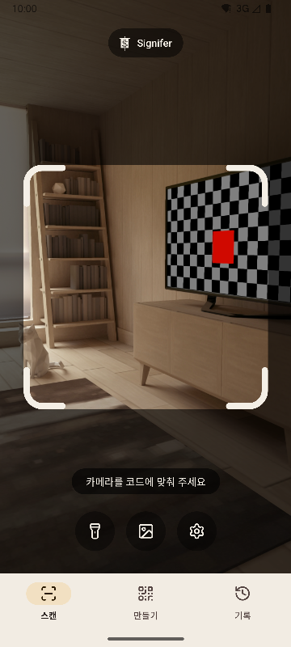
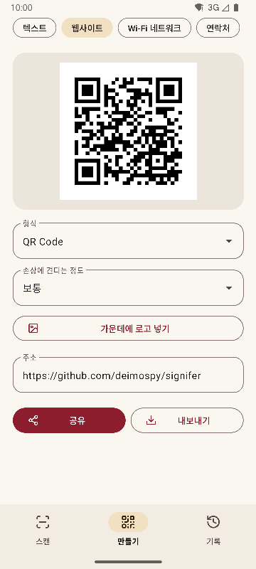
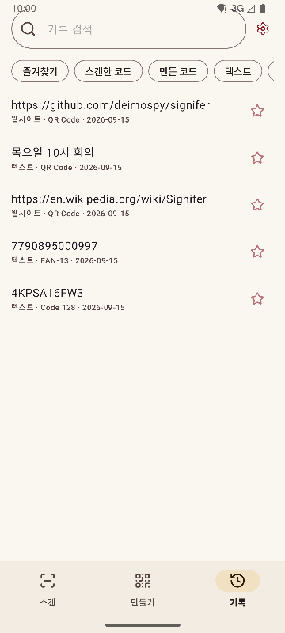
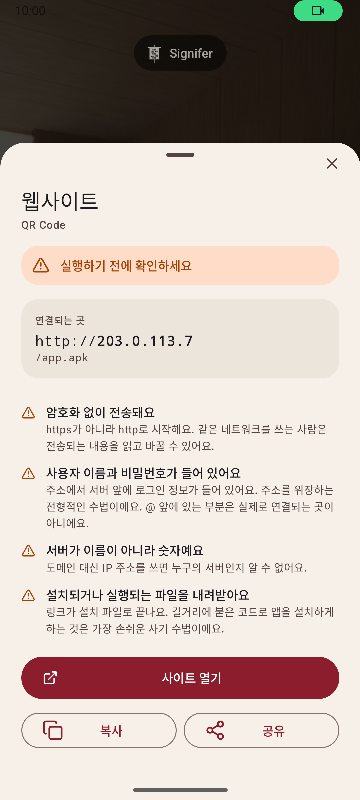

# Signifer

[English](README.md) · [Español](README.es.md) · [Português](README.pt.md) · [Deutsch](README.de.md) · [Français](README.fr.md) · [Italiano](README.it.md) · [Nederlands](README.nl.md) · [Polski](README.pl.md) · [Türkçe](README.tr.md) · [Suomi](README.fi.md) · [日本語](README.ja.md) · **한국어** · [简体中文](README.zh-CN.md) · [繁體中文](README.zh-TW.md)


Android용 QR 코드·바코드 스캐너 겸 생성기. 20종의 코드를 읽고 13종을 만들며, 의심스러운 링크를 알려 줍니다. 기능은 완벽하고, 빠르고 가볍습니다.

*Signifer*는 로마 군단의 기수였습니다. 다른 병사들이 따르는 표식인 **signum**을 든 사람이었죠. 코드 리더도 같은 일을 합니다. 맨눈으로는 읽을 수 없는 표식을 받아 보여 줍니다.

| 스캔 | 만들기 | 기록 | 결과 |
|---|---|---|---|
|  |  |  |  |

## 무엇이 다른가요

- **의심스러운 링크를 열기 전에 알려 줍니다.** 정해진 목록에 따른 스킴 검사와 함께 퓨니코드와 문자 체계 혼용, 주소에 포함된 로그인 정보, 사설 네트워크, 단축 URL, 설치 파일 다운로드, 텍스트 방향을 뒤집는 문자를 확인합니다. 서버는 브라우저와 같은 방식으로 해석하므로 `2130706433`은 휴대전화 자신으로 인식됩니다. 발견된 문제는 색으로만 표시하지 않고 이유를 설명합니다.
- **스스로 아무것도 열지 않습니다.** 모든 작업에는 탭이 필요하며, 탭하는 순간 연결되는 곳을 다시 분석합니다.
- **네트워크를 사용하지 않습니다.** `INTERNET` 권한을 선언하지 않으므로 시스템이 모든 연결을 막습니다. 컴파일된 패키지에서 확인했습니다. [docs/AUDITORIA.md](docs/AUDITORIA.md)를 참고하세요.
- **광고, 결제, 추적이 없습니다.** 감사 과정에서 널리 쓰이는 분석·광고 SDK의 흔적을 패키지에서 찾지만, 하나도 나오지 않습니다.
- **저장소 권한이 필요 없습니다.** 이미지는 시스템 선택기를 통해 선택한 것만 전달됩니다. 권한은 카메라와 진동뿐입니다.
- **민감한 내용은 자동으로 저장하지 않습니다.** Wi-Fi 비밀번호는 결과 화면에서 직접 요청할 때만 기록에 저장됩니다.
- Apache-2.0 라이선스의 **오픈 소스**입니다.

## 스캔

- 프레임 안에 있는 것만 읽고, 읽은 코드를 초록색으로 채웁니다. 여러 코드가 보여도 어느 것을 읽었는지 알 수 있습니다.
- 하드 디스크의 일련번호처럼 가늘고 긴 라벨도 읽습니다.
- 손가락을 벌리거나 두 번 탭해서 확대하고, 탭한 곳에 초점을 맞춥니다.
- 손전등, 이미지에서 읽기, 선택형 진동과 소리.
- 어려운 이미지 225장으로 인식률을 측정했습니다. [docs/RENDIMIENTO.md](docs/RENDIMIENTO.md)를 참고하세요.

## 지원 형식

**읽기 (20)**

매트릭스형: `QR_CODE` · `MICRO_QR_CODE` · `RMQR_CODE` · `DATA_MATRIX` · `AZTEC` · `MAXICODE`

유통: `EAN_8` · `EAN_13` · `UPC_A` · `UPC_E` · `DATA_BAR` · `DATA_BAR_EXPANDED` · `DATA_BAR_LIMITED`

산업·물류: `CODE_39` · `CODE_93` · `CODE_128` · `ITF` · `CODABAR` · `PDF_417` · `DX_FILM_EDGE`

**만들기 (13)**

`QR_CODE` · `DATA_MATRIX` · `AZTEC` · `PDF_417` · `CODE_128` · `CODE_39` · `CODE_93` · `EAN_13` · `EAN_8` · `UPC_A` · `UPC_E` · `ITF` · `CODABAR`

9가지 콘텐츠 유형: 텍스트, 웹사이트, Wi-Fi, 연락처(vCard 3.0), 이메일, 전화, 문자, 위치, 일정(iCalendar). 실시간 미리보기, 가운데 로고(선택), PNG·SVG 내보내기를 지원합니다. 코드를 만들기 전에 내용이 형식에 맞는지 확인하며, 대비가 부족한 코드는 내보내지 않습니다.

## 지원 언어

영어, 스페인어, 포르투갈어, 독일어, 프랑스어, 이탈리아어, 네덜란드어, 폴란드어, 튀르키예어, 핀란드어, 일본어, 한국어, 중국어 간체, 중국어 번체(대만). 휴대전화 언어를 따르며, 설정에서 다른 언어를 고를 수 있습니다.

## 시스템 연동

- 빠른 설정 타일로 앱 목록을 열지 않고 스캔할 수 있습니다.
- 아이콘 바로가기로 세 화면에 바로 이동합니다.
- 기존 ZXing 인텐트에 응답합니다. 다른 앱이 스캔을 요청하면 화면을 보여 주지 않고 결과를 돌려줍니다.
- 갤러리나 브라우저에서 공유한 이미지를 받습니다.

## 빌드

JDK 17과 Android SDK 36이 필요합니다.

```
./gradlew :app:assembleRelease
```

아키텍처별로 패키지가 하나씩 만들어집니다. 휴대전화에는 자기 것만 설치됩니다.

## 검증

```
./gradlew :app:testDebugUnitTest         # 단위 테스트, 에뮬레이터 없이
./gradlew :app:lintRelease               # 경고를 오류로 처리하는 정적 분석
./gradlew :app:connectedDebugAndroidTest # 기기 테스트
python tools/check_purity.py             # 도메인 계층은 Android를 가져오지 않으며 보이지 않는 문자도 없음
python tools/measure.py                  # 프로젝트 한도 대비 크기
python tools/audit.py                    # 패키지의 권한과 흔적
python tools/screenshots.py              # 이 문서용 스크린샷, 에뮬레이터 연결 필요
```

## 문서

기술 문서는 스페인어로 작성되어 있습니다.

| 문서 | 내용 |
|---|---|
| [MEDICIONES.md](docs/MEDICIONES.md) | 커밋별 크기와 그 변화의 원인 |
| [RENDIMIENTO.md](docs/RENDIMIENTO.md) | 인식률, 처리 시간, 시작 시간 |
| [AUDITORIA.md](docs/AUDITORIA.md) | 배포되는 패키지 안에 들어 있는 것 |
| [DECISIONES.md](docs/DECISIONES.md) | 열려 있던 결정 사항과 그 결론 |
| [marca/](docs/marca) | SVG 형식의 깃발 |

## Signifer 후원하기

Signifer는 무료이며 광고도 추적도 없습니다. 도움이 되었다면 개발을 후원해 주세요.

[](https://github.com/sponsors/deimospy)
[](https://buymeacoffee.com/deimospy)

## 라이선스

Apache License 2.0. [LICENSE](LICENSE)를 참고하세요.
