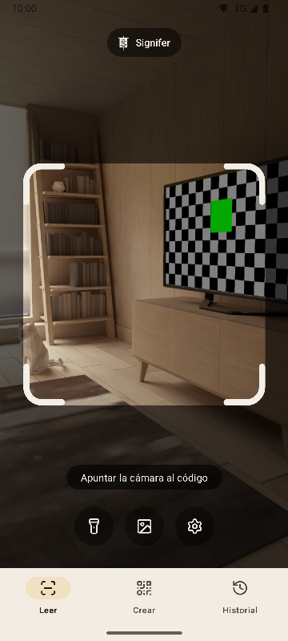
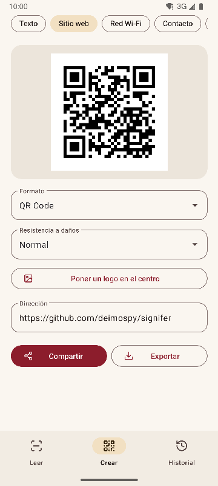
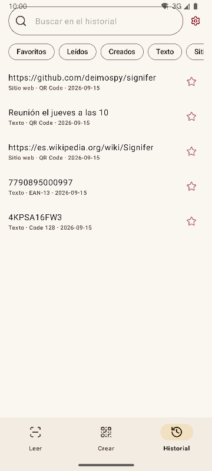
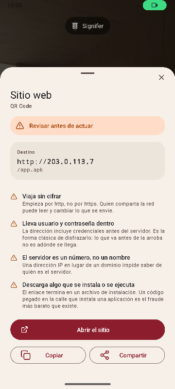

# Signifer


Lector y creador de códigos QR y de barras para Android. Lee 20 tipos de
códigos, crea 13 y avisa de enlaces sospechosos. Completa, rápida y liviana.

*Signifer* era el portaestandarte de la legión romana: el que lleva el
**signum**, la señal que el resto sigue. Un lector de códigos hace lo mismo:
toma una señal que nadie puede leer a simple vista y la enseña.

| Leer | Crear | Historial | Resultado |
|---|---|---|---|
|  |  |  |  |

## Qué la distingue

- **Avisa de enlaces sospechosos antes de abrirlos.** Esquemas contra una lista
  cerrada, punycode y mezcla de alfabetos, credenciales incrustadas, redes
  privadas, acortadores, descargas de instalables y caracteres que invierten el
  texto. El servidor se resuelve como lo resuelve el navegador, así que
  `2130706433` se reconoce como el propio teléfono. Cada hallazgo viene
  explicado, no solo coloreado.
- **Nunca abre nada por su cuenta.** Toda acción exige una pulsación, y el
  destino se vuelve a analizar en el momento de pulsar.
- **Sin red.** El permiso `INTERNET` no se declara, así que el sistema impide
  abrir cualquier conexión. Se comprueba sobre el binario compilado, ver
  [docs/AUDITORIA.md](docs/AUDITORIA.md).
- **Sin anuncios, sin compras y sin rastreo.** La auditoría busca en el binario
  las huellas de los SDK de analítica y publicidad más comunes. Ninguna aparece.
- **Sin permisos de almacenamiento.** Las imágenes llegan por el selector del
  sistema, que solo entrega la que se elige. Los únicos permisos son cámara y
  vibración.
- **Contenido sensible fuera del guardado automático.** Una clave de Wi-Fi no
  se guarda en el historial salvo que se pida en la pantalla de resultado.
- **Código abierto** bajo Apache-2.0.

## Lectura

- Solo lee lo que está dentro del marco y rellena de verde el código leído,
  para saber cuál fue cuando hay varios a la vista.
- Etiquetas finas y largas, como los números de serie de un disco duro.
- Zoom con pellizco o doble toque, y enfoque en el punto que se toca.
- Linterna, lectura desde una imagen, vibración y sonido opcionales.
- Tasa de detección medida sobre un banco de 225 imágenes difíciles, ver
  [docs/RENDIMIENTO.md](docs/RENDIMIENTO.md).

## Formatos

**Lectura (20)**

Matriciales: `QR_CODE` · `MICRO_QR_CODE` · `RMQR_CODE` · `DATA_MATRIX` ·
`AZTEC` · `MAXICODE`

Comercio: `EAN_8` · `EAN_13` · `UPC_A` · `UPC_E` · `DATA_BAR` ·
`DATA_BAR_EXPANDED` · `DATA_BAR_LIMITED`

Industria y logística: `CODE_39` · `CODE_93` · `CODE_128` · `ITF` · `CODABAR` ·
`PDF_417` · `DX_FILM_EDGE`

**Creación (13)**

`QR_CODE` · `DATA_MATRIX` · `AZTEC` · `PDF_417` · `CODE_128` · `CODE_39` ·
`CODE_93` · `EAN_13` · `EAN_8` · `UPC_A` · `UPC_E` · `ITF` · `CODABAR`

Nueve tipos de contenido: texto, sitio web, Wi-Fi, contacto (vCard 3.0),
correo, teléfono, SMS, ubicación y evento (iCalendar). Vista previa en vivo,
logotipo opcional en el centro y exportación a PNG y SVG. La carga se comprueba
contra el formato antes de generar, y un código con poco contraste no se
exporta.

## Idiomas

Inglés, español, portugués, alemán, francés, italiano, neerlandés, polaco,
turco, finés, japonés, coreano, chino simplificado y chino de Taiwán. Sigue el
idioma del teléfono y se puede elegir otro en los ajustes.

## Integración con el sistema

- Azulejo en el panel desplegable, para leer sin abrir el cajón de aplicaciones.
- Atajos en el icono a los tres destinos.
- Responde al intent heredado de ZXing: otras aplicaciones piden una lectura y
  reciben el resultado sin ver la interfaz.
- Acepta imágenes compartidas desde la galería o el navegador.

## Compilar

Requiere JDK 17 y el SDK de Android 36.

```
./gradlew :app:assembleRelease
```

El resultado es un paquete por arquitectura. Un teléfono solo instala el suyo.

## Comprobar

```
./gradlew :app:testDebugUnitTest         # pruebas unitarias, sin emulador
./gradlew :app:lintRelease               # análisis estático con los avisos como errores
./gradlew :app:connectedDebugAndroidTest # pruebas en dispositivo
python tools/check_purity.py             # el dominio no importa Android, sin caracteres invisibles
python tools/measure.py                  # peso contra el techo del proyecto
python tools/audit.py                    # permisos y rastros del binario
python tools/screenshots.py              # capturas de este documento, con un emulador conectado
```

## Documentación

| Documento | Qué contiene |
|---|---|
| [MEDICIONES.md](docs/MEDICIONES.md) | Peso commit a commit y qué movió la aguja |
| [RENDIMIENTO.md](docs/RENDIMIENTO.md) | Tasa de detección, tiempos y arranque |
| [AUDITORIA.md](docs/AUDITORIA.md) | Qué hay dentro del binario que se publica |
| [DECISIONES.md](docs/DECISIONES.md) | Las decisiones abiertas y con qué se cerraron |
| [marca/](docs/marca) | El estandarte en SVG |

## Licencia

Apache License 2.0. Ver [LICENSE](LICENSE).
