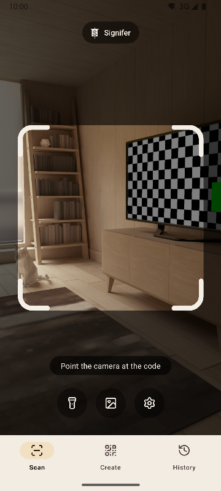
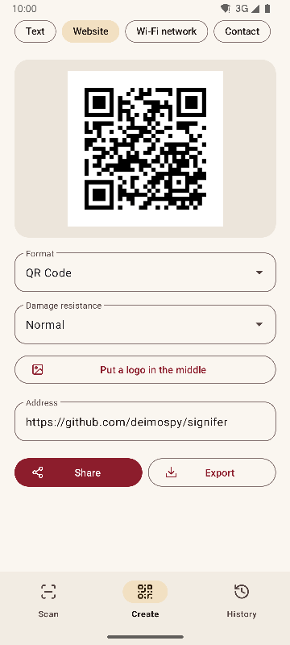
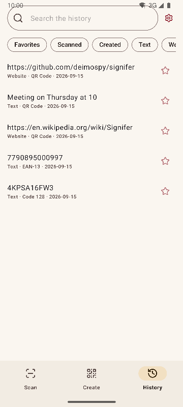
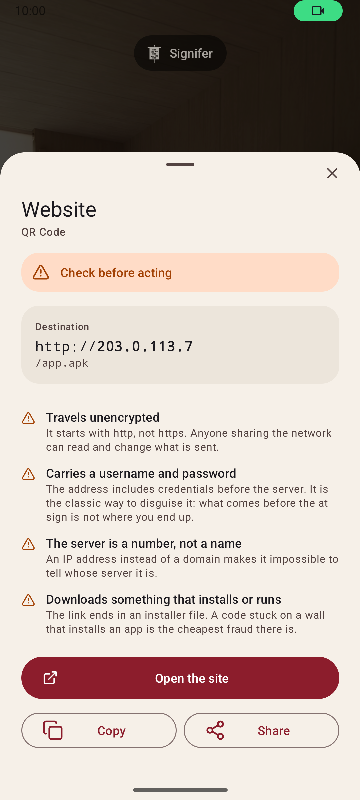

# Signifer

**English** · [Español](README.es.md) · [Português](README.pt.md) · [Deutsch](README.de.md) · [Français](README.fr.md) · [Italiano](README.it.md) · [Nederlands](README.nl.md) · [Polski](README.pl.md) · [Türkçe](README.tr.md) · [Suomi](README.fi.md) · [日本語](README.ja.md) · [한국어](README.ko.md) · [简体中文](README.zh-CN.md) · [繁體中文](README.zh-TW.md)


QR code and barcode scanner and creator for Android. Scans 20 code types, creates 13 and warns about suspicious links. Complete, fast and lightweight.

*Signifer* was the standard-bearer of the Roman legion: the one who carried the **signum**, the sign the rest followed. A code reader does the same: it takes a sign nobody can read with the naked eye and shows it.

| Scan | Create | History | Result |
|---|---|---|---|
|  |  |  |  |

## What sets it apart

- **Warns about suspicious links before opening them.** Schemes checked against a closed list, punycode and mixed alphabets, embedded credentials, private networks, shorteners, installer downloads and characters that reverse text. The server is resolved the way a browser resolves it, so `2130706433` is recognized as the phone itself. Every finding is explained, not just colored.
- **Never opens anything on its own.** Every action takes a tap, and the destination is analyzed again at the moment of tapping.
- **No network.** The `INTERNET` permission is not declared, so the system blocks any connection. Checked on the compiled binary, see [docs/AUDITORIA.md](docs/AUDITORIA.md).
- **No ads, no purchases, no tracking.** The audit searches the binary for traces of the most common analytics and advertising SDKs. None appears.
- **No storage permissions.** Images arrive through the system picker, which only hands over the one you choose. The only permissions are camera and vibration.
- **Sensitive content stays out of automatic saving.** A Wi-Fi password is not saved to history unless you ask for it on the result screen.
- **Open source** under Apache-2.0.

## Scanning

- Only reads what is inside the frame and fills the read code in green, so you know which one it was when several are in view.
- Thin, long labels, like the serial numbers on hard drives.
- Pinch or double-tap zoom, and focus on the spot you tap.
- Flashlight, reading from an image, optional vibration and sound.
- Detection rate measured on a set of 225 difficult images, see [docs/RENDIMIENTO.md](docs/RENDIMIENTO.md).

## Formats

**Scanning (20)**

Matrix: `QR_CODE` · `MICRO_QR_CODE` · `RMQR_CODE` · `DATA_MATRIX` · `AZTEC` · `MAXICODE`

Retail: `EAN_8` · `EAN_13` · `UPC_A` · `UPC_E` · `DATA_BAR` · `DATA_BAR_EXPANDED` · `DATA_BAR_LIMITED`

Industry and logistics: `CODE_39` · `CODE_93` · `CODE_128` · `ITF` · `CODABAR` · `PDF_417` · `DX_FILM_EDGE`

**Creating (13)**

`QR_CODE` · `DATA_MATRIX` · `AZTEC` · `PDF_417` · `CODE_128` · `CODE_39` · `CODE_93` · `EAN_13` · `EAN_8` · `UPC_A` · `UPC_E` · `ITF` · `CODABAR`

Nine content types: text, website, Wi-Fi, contact (vCard 3.0), email, phone, SMS, location and event (iCalendar). Live preview, optional logo in the center and export to PNG and SVG. The payload is checked against the format before generating, and a code with too little contrast is not exported.

## Languages

English, Spanish, Portuguese, German, French, Italian, Dutch, Polish, Turkish, Finnish, Japanese, Korean, Simplified Chinese and Traditional Chinese (Taiwan). It follows the phone's language, and another one can be chosen in the settings.

## System integration

- Quick settings tile, to scan without opening the app drawer.
- Icon shortcuts to the three sections.
- Answers the legacy ZXing intent: other apps request a scan and get the result without seeing the interface.
- Accepts images shared from the gallery or the browser.

## Build

Requires JDK 17 and the Android SDK 36.

```
./gradlew :app:assembleRelease
```

The output is one package per architecture. A phone only installs its own.

## Checks

```
./gradlew :app:testDebugUnitTest         # unit tests, no emulator
./gradlew :app:lintRelease               # static analysis with warnings as errors
./gradlew :app:connectedDebugAndroidTest # on-device tests
python tools/check_purity.py             # the domain does not import Android, no invisible characters
python tools/measure.py                  # size against the project ceiling
python tools/audit.py                    # permissions and traces in the binary
python tools/screenshots.py              # screenshots for these documents, with an emulator connected
```

## Documentation

The technical documents are in Spanish.

| Document | Contents |
|---|---|
| [MEDICIONES.md](docs/MEDICIONES.md) | Size commit by commit and what moved the needle |
| [RENDIMIENTO.md](docs/RENDIMIENTO.md) | Detection rate, timings and startup |
| [AUDITORIA.md](docs/AUDITORIA.md) | What is inside the binary that gets published |
| [DECISIONES.md](docs/DECISIONES.md) | The open decisions and how they were closed |
| [marca/](docs/marca) | The banner in SVG |

## Support Signifer

Signifer is free, with no ads and no tracking. If it is useful to you, you can support its development:

[](https://github.com/sponsors/deimospy)
[](https://buymeacoffee.com/deimospy)

## License

Apache License 2.0. See [LICENSE](LICENSE).
