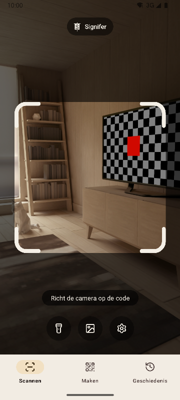
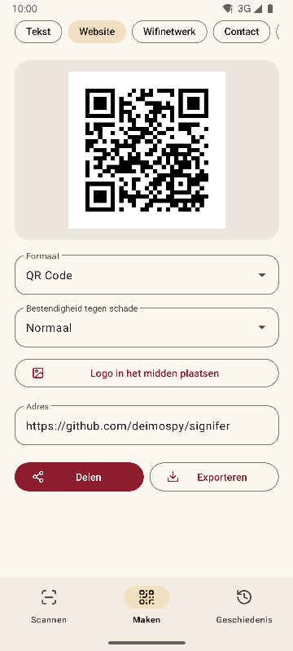
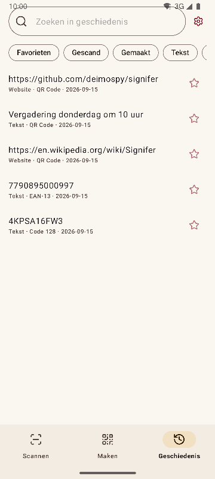
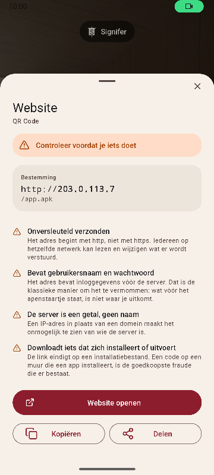

# Signifer

[English](README.md) · [Español](README.es.md) · [Português](README.pt.md) · [Deutsch](README.de.md) · [Français](README.fr.md) · [Italiano](README.it.md) · **Nederlands** · [Polski](README.pl.md) · [Türkçe](README.tr.md) · [Suomi](README.fi.md) · [日本語](README.ja.md) · [한국어](README.ko.md) · [简体中文](README.zh-CN.md) · [繁體中文](README.zh-TW.md)


QR-code- en barcodescanner en -maker voor Android. Leest 20 soorten codes, maakt er 13 en waarschuwt voor verdachte links. Compleet, snel en licht.

*Signifer* was de vaandeldrager van het Romeinse legioen: degene die het **signum** droeg, het teken dat de rest volgde. Een codelezer doet hetzelfde: hij neemt een teken dat niemand met het blote oog kan lezen en laat het zien.

| Scannen | Maken | Geschiedenis | Resultaat |
|---|---|---|---|
|  |  |  |  |

## Wat de app onderscheidt

- **Waarschuwt voor verdachte links voordat ze worden geopend.** Schema's gecontroleerd tegen een gesloten lijst, punycode en gemengde alfabetten, ingebedde inloggegevens, privénetwerken, verkorte links, downloads van installatiebestanden en tekens die tekst omdraaien. De server wordt opgezocht zoals de browser dat doet, dus `2130706433` wordt herkend als de telefoon zelf. Elke bevinding wordt uitgelegd, niet alleen gekleurd.
- **Opent nooit iets uit zichzelf.** Elke actie vraagt om een tik, en de bestemming wordt op het moment van tikken opnieuw gecontroleerd.
- **Geen netwerk.** De toestemming `INTERNET` is niet gedeclareerd, dus het systeem blokkeert elke verbinding. Gecontroleerd op het gecompileerde pakket, zie [docs/AUDITORIA.md](docs/AUDITORIA.md).
- **Geen advertenties, geen aankopen, geen tracking.** De audit zoekt in het pakket naar sporen van de meest gebruikte analyse- en advertentie-SDK's. Er duikt er geen op.
- **Geen opslagtoestemmingen.** Afbeeldingen komen via de systeemkiezer, die alleen de gekozen afbeelding doorgeeft. De enige toestemmingen zijn camera en trillen.
- **Gevoelige inhoud wordt niet automatisch opgeslagen.** Een wifiwachtwoord komt alleen in de geschiedenis als je daar zelf om vraagt op het resultaatscherm.
- **Open source** onder Apache-2.0.

## Scannen

- Leest alleen wat binnen het kader valt en kleurt de gelezen code groen, zodat je weet welke het was als er meerdere in beeld zijn.
- Smalle, lange etiketten, zoals de serienummers op harde schijven.
- Zoomen door te knijpen of dubbel te tikken, en scherpstellen op de plek die je aantikt.
- Zaklamp, lezen uit een afbeelding, trillen en geluid naar keuze.
- Detectiepercentage gemeten op een set van 225 lastige afbeeldingen, zie [docs/RENDIMIENTO.md](docs/RENDIMIENTO.md).

## Formaten

**Lezen (20)**

Matrixcodes: `QR_CODE` · `MICRO_QR_CODE` · `RMQR_CODE` · `DATA_MATRIX` · `AZTEC` · `MAXICODE`

Handel: `EAN_8` · `EAN_13` · `UPC_A` · `UPC_E` · `DATA_BAR` · `DATA_BAR_EXPANDED` · `DATA_BAR_LIMITED`

Industrie en logistiek: `CODE_39` · `CODE_93` · `CODE_128` · `ITF` · `CODABAR` · `PDF_417` · `DX_FILM_EDGE`

**Maken (13)**

`QR_CODE` · `DATA_MATRIX` · `AZTEC` · `PDF_417` · `CODE_128` · `CODE_39` · `CODE_93` · `EAN_13` · `EAN_8` · `UPC_A` · `UPC_E` · `ITF` · `CODABAR`

Negen soorten inhoud: tekst, website, wifi, contact (vCard 3.0), e-mail, telefoon, sms, locatie en afspraak (iCalendar). Live voorbeeld, optioneel logo in het midden en export naar PNG en SVG. De inhoud wordt vóór het maken tegen het formaat gecontroleerd, en een code met te weinig contrast wordt niet geëxporteerd.

## Talen

Engels, Spaans, Portugees, Duits, Frans, Italiaans, Nederlands, Pools, Turks, Fins, Japans, Koreaans, vereenvoudigd Chinees en traditioneel Chinees (Taiwan). De app volgt de taal van de telefoon; in de instellingen kun je een andere kiezen.

## Integratie met het systeem

- Tegel in de snelle instellingen, om te scannen zonder de app-lijst te openen.
- Snelkoppelingen op het pictogram naar de drie onderdelen.
- Reageert op de oude ZXing-intent: andere apps vragen om een scan en krijgen het resultaat zonder de interface te zien.
- Accepteert afbeeldingen die vanuit de galerij of de browser worden gedeeld.

## Bouwen

Vereist JDK 17 en de Android SDK 36.

```
./gradlew :app:assembleRelease
```

Het resultaat is één pakket per architectuur. Een telefoon installeert alleen het zijne.

## Controleren

```
./gradlew :app:testDebugUnitTest         # unittests, zonder emulator
./gradlew :app:lintRelease               # statische analyse met waarschuwingen als fouten
./gradlew :app:connectedDebugAndroidTest # tests op het apparaat
python tools/check_purity.py             # het domein importeert geen Android, geen onzichtbare tekens
python tools/measure.py                  # grootte tegen het plafond van het project
python tools/audit.py                    # toestemmingen en sporen in het pakket
python tools/screenshots.py              # schermafbeeldingen voor deze documenten, met een verbonden emulator
```

## Documentatie

De technische documenten zijn in het Spaans.

| Document | Inhoud |
|---|---|
| [MEDICIONES.md](docs/MEDICIONES.md) | Grootte per commit en wat het verschil maakte |
| [RENDIMIENTO.md](docs/RENDIMIENTO.md) | Detectiepercentage, tijden en opstarten |
| [AUDITORIA.md](docs/AUDITORIA.md) | Wat er in het gepubliceerde pakket zit |
| [DECISIONES.md](docs/DECISIONES.md) | De open beslissingen en hoe ze zijn genomen |
| [marca/](docs/marca) | Het vaandel in SVG |

## Steun Signifer

Signifer is gratis, zonder advertenties en zonder tracking. Heb je er iets aan, dan kun je de ontwikkeling steunen:

[](https://github.com/sponsors/deimospy)
[](https://buymeacoffee.com/deimospy)

## Licentie

Apache License 2.0. Zie [LICENSE](LICENSE).
