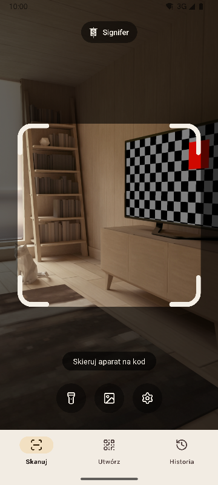
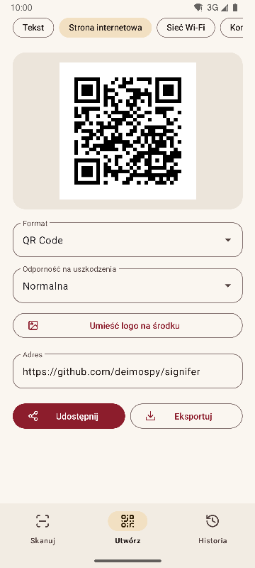
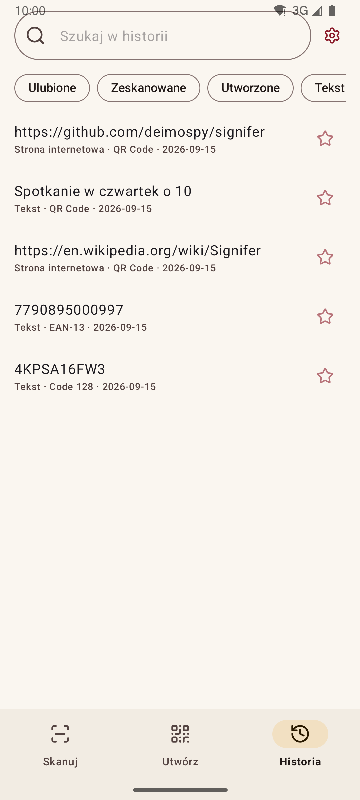
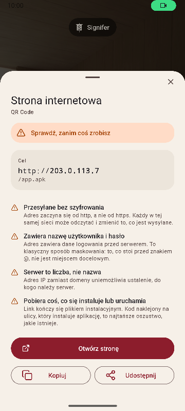

# Signifer

[English](README.md) · [Español](README.es.md) · [Português](README.pt.md) · [Deutsch](README.de.md) · [Français](README.fr.md) · [Italiano](README.it.md) · [Nederlands](README.nl.md) · **Polski** · [Türkçe](README.tr.md) · [Suomi](README.fi.md) · [日本語](README.ja.md) · [한국어](README.ko.md) · [简体中文](README.zh-CN.md) · [繁體中文](README.zh-TW.md)


Czytnik i generator kodów QR i kreskowych na Androida. Odczytuje 20 rodzajów kodów, tworzy 13 i ostrzega przed podejrzanymi linkami. Kompletna, szybka i lekka.

*Signifer* był chorążym rzymskiego legionu: tym, który niósł **signum**, znak, za którym podążała reszta. Czytnik kodów robi to samo: bierze znak, którego nikt nie odczyta gołym okiem, i go pokazuje.

| Skanuj | Utwórz | Historia | Wynik |
|---|---|---|---|
|  |  |  |  |

## Co ją wyróżnia

- **Ostrzega przed podejrzanymi linkami, zanim zostaną otwarte.** Schematy sprawdzane z zamkniętą listą, punycode i mieszane alfabety, osadzone dane logowania, sieci prywatne, skrócone linki, pobieranie plików instalacyjnych i znaki odwracające tekst. Serwer jest rozpoznawany tak, jak robi to przeglądarka, dlatego `2130706433` zostaje rozpoznany jako sam telefon. Każde zastrzeżenie jest wyjaśnione, a nie tylko pokolorowane.
- **Nigdy niczego nie otwiera sama.** Każda akcja wymaga dotknięcia, a cel jest ponownie analizowany w chwili dotknięcia.
- **Bez sieci.** Uprawnienie `INTERNET` nie jest deklarowane, więc system blokuje każde połączenie. Sprawdzone na skompilowanym pliku binarnym, zobacz [docs/AUDITORIA.md](docs/AUDITORIA.md).
- **Bez reklam, zakupów i śledzenia.** Audyt szuka w pliku binarnym śladów najpopularniejszych SDK analitycznych i reklamowych. Żaden się nie pojawia.
- **Bez uprawnień do pamięci.** Obrazy trafiają przez systemowy selektor, który przekazuje tylko wybrany plik. Jedyne uprawnienia to aparat i wibracje.
- **Wrażliwe treści poza automatycznym zapisem.** Hasło do Wi-Fi nie trafia do historii, chyba że poprosisz o to na ekranie wyniku.
- **Open source** na licencji Apache-2.0.

## Skanowanie

- Odczytuje tylko to, co jest wewnątrz ramki, i wypełnia odczytany kod na zielono, żeby było wiadomo, który to był, gdy w kadrze jest ich kilka.
- Wąskie, długie etykiety, takie jak numery seryjne na dyskach twardych.
- Powiększanie gestem szczypania lub podwójnym dotknięciem oraz ostrzenie w dotkniętym miejscu.
- Latarka, odczyt z obrazu, opcjonalne wibracje i dźwięk.
- Skuteczność wykrywania zmierzona na zbiorze 225 trudnych obrazów, zobacz [docs/RENDIMIENTO.md](docs/RENDIMIENTO.md).

## Formaty

**Odczyt (20)**

Kody matrycowe: `QR_CODE` · `MICRO_QR_CODE` · `RMQR_CODE` · `DATA_MATRIX` · `AZTEC` · `MAXICODE`

Handel: `EAN_8` · `EAN_13` · `UPC_A` · `UPC_E` · `DATA_BAR` · `DATA_BAR_EXPANDED` · `DATA_BAR_LIMITED`

Przemysł i logistyka: `CODE_39` · `CODE_93` · `CODE_128` · `ITF` · `CODABAR` · `PDF_417` · `DX_FILM_EDGE`

**Tworzenie (13)**

`QR_CODE` · `DATA_MATRIX` · `AZTEC` · `PDF_417` · `CODE_128` · `CODE_39` · `CODE_93` · `EAN_13` · `EAN_8` · `UPC_A` · `UPC_E` · `ITF` · `CODABAR`

Dziewięć typów treści: tekst, strona internetowa, Wi-Fi, kontakt (vCard 3.0), e-mail, telefon, SMS, lokalizacja i wydarzenie (iCalendar). Podgląd na żywo, opcjonalne logo na środku oraz eksport do PNG i SVG. Treść jest sprawdzana pod kątem formatu przed wygenerowaniem, a kod o zbyt słabym kontraście nie zostanie wyeksportowany.

## Języki

Angielski, hiszpański, portugalski, niemiecki, francuski, włoski, niderlandzki, polski, turecki, fiński, japoński, koreański, chiński uproszczony i chiński tradycyjny (Tajwan). Aplikacja używa języka telefonu, a w ustawieniach można wybrać inny.

## Integracja z systemem

- Kafelek w szybkich ustawieniach, aby skanować bez otwierania listy aplikacji.
- Skróty na ikonie do trzech sekcji.
- Obsługuje klasyczny intent ZXing: inne aplikacje proszą o skan i otrzymują wynik bez wyświetlania interfejsu.
- Przyjmuje obrazy udostępnione z galerii lub przeglądarki.

## Kompilacja

Wymaga JDK 17 i Android SDK 36.

```
./gradlew :app:assembleRelease
```

Wynikiem jest jeden pakiet na architekturę. Telefon instaluje tylko swój.

## Weryfikacja

```
./gradlew :app:testDebugUnitTest         # testy jednostkowe, bez emulatora
./gradlew :app:lintRelease               # analiza statyczna z ostrzeżeniami jako błędami
./gradlew :app:connectedDebugAndroidTest # testy na urządzeniu
python tools/check_purity.py             # domena nie importuje Androida, brak niewidocznych znaków
python tools/measure.py                  # rozmiar względem limitu projektu
python tools/audit.py                    # uprawnienia i ślady w pliku binarnym
python tools/screenshots.py              # zrzuty ekranu do tych dokumentów, z podłączonym emulatorem
```

## Dokumentacja

Dokumenty techniczne są po hiszpańsku.

| Dokument | Zawartość |
|---|---|
| [MEDICIONES.md](docs/MEDICIONES.md) | Rozmiar commit po commicie i co go zmieniło |
| [RENDIMIENTO.md](docs/RENDIMIENTO.md) | Skuteczność wykrywania, czasy i uruchamianie |
| [AUDITORIA.md](docs/AUDITORIA.md) | Co jest w publikowanym pliku binarnym |
| [DECISIONES.md](docs/DECISIONES.md) | Otwarte decyzje i sposób ich rozstrzygnięcia |
| [marca/](docs/marca) | Sztandar w SVG |

## Wesprzyj Signifer

Signifer jest darmowa, bez reklam i bez śledzenia. Jeśli ci się przydaje, możesz wesprzeć jej rozwój:

[](https://github.com/sponsors/deimospy)
[](https://buymeacoffee.com/deimospy)

## Licencja

Apache License 2.0. Zobacz [LICENSE](LICENSE).
