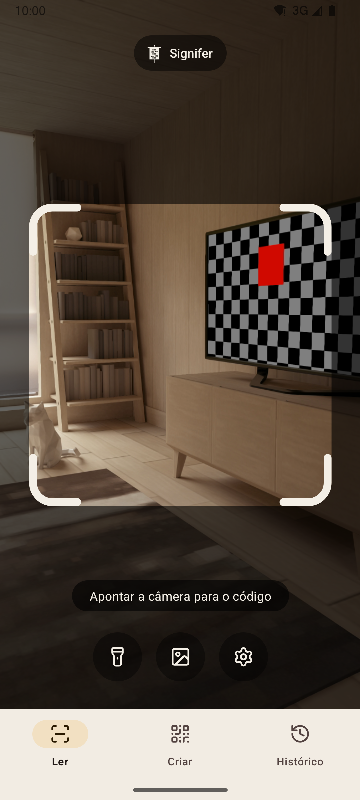
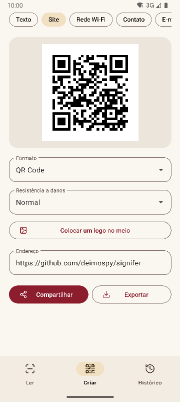
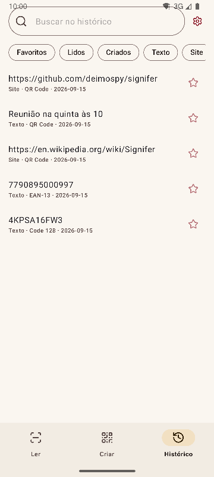
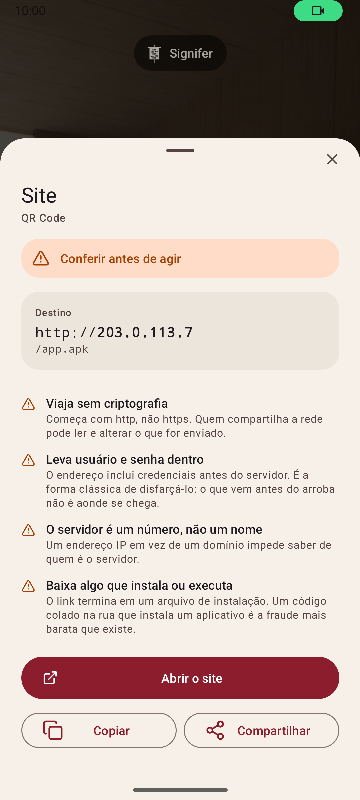

# Signifer

[English](README.md) · [Español](README.es.md) · **Português** · [Deutsch](README.de.md) · [Français](README.fr.md) · [Italiano](README.it.md) · [Nederlands](README.nl.md) · [Polski](README.pl.md) · [Türkçe](README.tr.md) · [Suomi](README.fi.md) · [日本語](README.ja.md) · [한국어](README.ko.md) · [简体中文](README.zh-CN.md) · [繁體中文](README.zh-TW.md)


Leitor e criador de códigos QR e de barras para Android. Lê 20 tipos de códigos, cria 13 e avisa sobre links suspeitos. Completo, rápido e leve.

*Signifer* era o porta-estandarte da legião romana: quem carregava o **signum**, o sinal que os demais seguiam. Um leitor de códigos faz o mesmo: pega um sinal que ninguém consegue ler a olho nu e o mostra.

| Ler | Criar | Histórico | Resultado |
|---|---|---|---|
|  |  |  |  |

## O que o torna diferente

- **Avisa sobre links suspeitos antes de abri-los.** Esquemas conferidos contra uma lista fechada, punycode e mistura de alfabetos, credenciais embutidas, redes privadas, encurtadores, downloads de instaladores e caracteres que invertem o texto. O servidor é resolvido como o navegador o resolve, então `2130706433` é reconhecido como o próprio telefone. Cada achado vem explicado, não só colorido.
- **Nunca abre nada sozinho.** Toda ação exige um toque, e o destino é analisado de novo no momento do toque.
- **Sem rede.** A permissão `INTERNET` não é declarada, então o sistema bloqueia qualquer conexão. Verificado no binário compilado, veja [docs/AUDITORIA.md](docs/AUDITORIA.md).
- **Sem anúncios, sem compras e sem rastreamento.** A auditoria procura no binário os rastros dos SDKs de análise e publicidade mais comuns. Nenhum aparece.
- **Sem permissões de armazenamento.** As imagens chegam pelo seletor do sistema, que entrega só a escolhida. As únicas permissões são câmera e vibração.
- **Conteúdo sensível fora do salvamento automático.** Uma senha de Wi-Fi não é salva no histórico, a menos que você peça na tela de resultado.
- **Código aberto** sob Apache-2.0.

## Leitura

- Só lê o que está dentro da moldura e preenche de verde o código lido, para saber qual foi quando há vários à vista.
- Etiquetas finas e longas, como os números de série de discos rígidos.
- Zoom com pinça ou toque duplo, e foco no ponto tocado.
- Lanterna, leitura a partir de uma imagem, vibração e som opcionais.
- Taxa de detecção medida em um banco de 225 imagens difíceis, veja [docs/RENDIMIENTO.md](docs/RENDIMIENTO.md).

## Formatos

**Leitura (20)**

Matriciais: `QR_CODE` · `MICRO_QR_CODE` · `RMQR_CODE` · `DATA_MATRIX` · `AZTEC` · `MAXICODE`

Comércio: `EAN_8` · `EAN_13` · `UPC_A` · `UPC_E` · `DATA_BAR` · `DATA_BAR_EXPANDED` · `DATA_BAR_LIMITED`

Indústria e logística: `CODE_39` · `CODE_93` · `CODE_128` · `ITF` · `CODABAR` · `PDF_417` · `DX_FILM_EDGE`

**Criação (13)**

`QR_CODE` · `DATA_MATRIX` · `AZTEC` · `PDF_417` · `CODE_128` · `CODE_39` · `CODE_93` · `EAN_13` · `EAN_8` · `UPC_A` · `UPC_E` · `ITF` · `CODABAR`

Nove tipos de conteúdo: texto, site, Wi-Fi, contato (vCard 3.0), e-mail, telefone, SMS, localização e evento (iCalendar). Pré-visualização ao vivo, logotipo opcional no centro e exportação para PNG e SVG. O conteúdo é verificado contra o formato antes de gerar, e um código com pouco contraste não é exportado.

## Idiomas

Inglês, espanhol, português, alemão, francês, italiano, holandês, polonês, turco, finlandês, japonês, coreano, chinês simplificado e chinês de Taiwan. Segue o idioma do telefone, e é possível escolher outro nas configurações.

## Integração com o sistema

- Bloco nas configurações rápidas, para ler sem abrir a gaveta de apps.
- Atalhos no ícone para as três seções.
- Responde à intent legada do ZXing: outros apps pedem uma leitura e recebem o resultado sem ver a interface.
- Aceita imagens compartilhadas da galeria ou do navegador.

## Compilar

Requer JDK 17 e o SDK do Android 36.

```
./gradlew :app:assembleRelease
```

O resultado é um pacote por arquitetura. Um telefone instala apenas o seu.

## Verificar

```
./gradlew :app:testDebugUnitTest         # testes unitários, sem emulador
./gradlew :app:lintRelease               # análise estática com avisos como erros
./gradlew :app:connectedDebugAndroidTest # testes no dispositivo
python tools/check_purity.py             # o domínio não importa Android, sem caracteres invisíveis
python tools/measure.py                  # tamanho contra o teto do projeto
python tools/audit.py                    # permissões e rastros do binário
python tools/screenshots.py              # capturas destes documentos, com um emulador conectado
```

## Documentação

Os documentos técnicos estão em espanhol.

| Documento | O que contém |
|---|---|
| [MEDICIONES.md](docs/MEDICIONES.md) | Tamanho commit a commit e o que fez a diferença |
| [RENDIMIENTO.md](docs/RENDIMIENTO.md) | Taxa de detecção, tempos e inicialização |
| [AUDITORIA.md](docs/AUDITORIA.md) | O que há dentro do binário publicado |
| [DECISIONES.md](docs/DECISIONES.md) | As decisões em aberto e como foram fechadas |
| [marca/](docs/marca) | O estandarte em SVG |

## Apoie o Signifer

O Signifer é gratuito, sem anúncios e sem rastreamento. Se ele for útil para você, pode apoiar o desenvolvimento:

[](https://github.com/sponsors/deimospy)
[](https://buymeacoffee.com/deimospy)

## Licença

Apache License 2.0. Veja [LICENSE](LICENSE).
