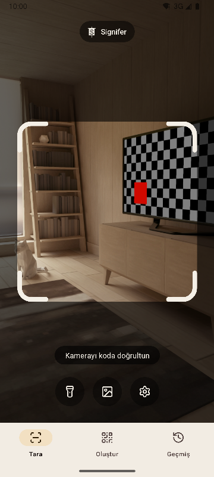
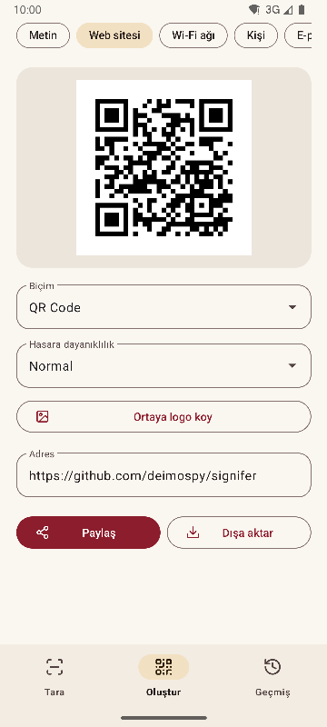
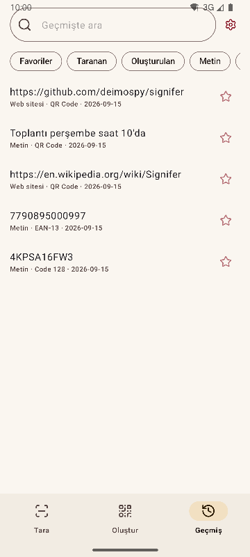
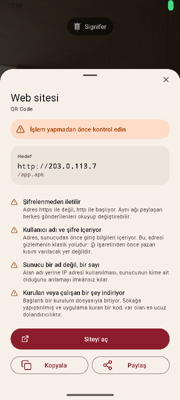

# Signifer

[English](README.md) · [Español](README.es.md) · [Português](README.pt.md) · [Deutsch](README.de.md) · [Français](README.fr.md) · [Italiano](README.it.md) · [Nederlands](README.nl.md) · [Polski](README.pl.md) · **Türkçe** · [Suomi](README.fi.md) · [日本語](README.ja.md) · [한국어](README.ko.md) · [简体中文](README.zh-CN.md) · [繁體中文](README.zh-TW.md)


Android için QR kod ve barkod okuyucu ve oluşturucu. 20 tür kodu okur, 13 türünü oluşturur ve şüpheli bağlantılara karşı uyarır. Eksiksiz, hızlı ve hafif.

*Signifer*, Roma lejyonunun sancaktarıydı: diğerlerinin takip ettiği işaret olan **signum**'u taşıyan kişi. Bir kod okuyucu da aynısını yapar: kimsenin çıplak gözle okuyamadığı bir işareti alır ve gösterir.

| Tara | Oluştur | Geçmiş | Sonuç |
|---|---|---|---|
|  |  |  |  |

## Onu farklı kılan

- **Şüpheli bağlantıları açmadan önce uyarır.** Kapalı bir listeye göre denetlenen şemalar, punycode ve karışık alfabeler, gömülü giriş bilgileri, özel ağlar, kısaltılmış bağlantılar, kurulum dosyası indirmeleri ve metni ters çeviren karakterler. Sunucu tarayıcının çözdüğü gibi çözülür; bu yüzden `2130706433` telefonun kendisi olarak tanınır. Her tespit yalnızca renklendirilmez, açıklanır.
- **Hiçbir şeyi kendiliğinden açmaz.** Her işlem bir dokunuş gerektirir ve hedef, dokunulduğu anda yeniden incelenir.
- **Ağ yok.** `INTERNET` izni tanımlanmaz, bu yüzden sistem her türlü bağlantıyı engeller. Derlenmiş paket üzerinde doğrulanır, bkz. [docs/AUDITORIA.md](docs/AUDITORIA.md).
- **Reklam, satın alma ve izleme yok.** Denetim, pakette en yaygın analiz ve reklam SDK'larının izlerini arar. Hiçbiri çıkmaz.
- **Depolama izni yok.** Görseller, yalnızca seçileni teslim eden sistem seçicisiyle gelir. Tek izinler kamera ve titreşimdir.
- **Hassas içerik otomatik kaydedilmez.** Bir Wi-Fi şifresi, sonuç ekranında siz istemedikçe geçmişe kaydedilmez.
- Apache-2.0 lisanslı **açık kaynak**.

## Tarama

- Yalnızca çerçevenin içindekini okur ve okunan kodu yeşille doldurur; böylece görüşte birden fazla kod varken hangisinin okunduğu anlaşılır.
- Sabit disklerdeki seri numaraları gibi ince ve uzun etiketler.
- Kıstırarak veya çift dokunarak yakınlaştırma ve dokunulan noktaya odaklama.
- El feneri, görselden okuma, isteğe bağlı titreşim ve ses.
- 225 zor görselden oluşan bir sette ölçülen tespit oranı, bkz. [docs/RENDIMIENTO.md](docs/RENDIMIENTO.md).

## Biçimler

**Okuma (20)**

Matris kodları: `QR_CODE` · `MICRO_QR_CODE` · `RMQR_CODE` · `DATA_MATRIX` · `AZTEC` · `MAXICODE`

Ticaret: `EAN_8` · `EAN_13` · `UPC_A` · `UPC_E` · `DATA_BAR` · `DATA_BAR_EXPANDED` · `DATA_BAR_LIMITED`

Sanayi ve lojistik: `CODE_39` · `CODE_93` · `CODE_128` · `ITF` · `CODABAR` · `PDF_417` · `DX_FILM_EDGE`

**Oluşturma (13)**

`QR_CODE` · `DATA_MATRIX` · `AZTEC` · `PDF_417` · `CODE_128` · `CODE_39` · `CODE_93` · `EAN_13` · `EAN_8` · `UPC_A` · `UPC_E` · `ITF` · `CODABAR`

Dokuz içerik türü: metin, web sitesi, Wi-Fi, kişi (vCard 3.0), e-posta, telefon, SMS, konum ve etkinlik (iCalendar). Canlı önizleme, ortada isteğe bağlı logo ve PNG ile SVG olarak dışa aktarma. İçerik, oluşturmadan önce biçime göre denetlenir; kontrastı yetersiz bir kod dışa aktarılmaz.

## Diller

İngilizce, İspanyolca, Portekizce, Almanca, Fransızca, İtalyanca, Felemenkçe, Lehçe, Türkçe, Fince, Japonca, Korece, Basitleştirilmiş Çince ve Geleneksel Çince (Tayvan). Telefonun dilini izler; ayarlardan başka bir dil seçilebilir.

## Sistem entegrasyonu

- Uygulama listesini açmadan taramak için hızlı ayarlarda bir kutucuk.
- Simgede üç bölüme giden kısayollar.
- Eski ZXing intent'ine yanıt verir: başka uygulamalar tarama ister ve arayüzü görmeden sonucu alır.
- Galeriden veya tarayıcıdan paylaşılan görselleri kabul eder.

## Derleme

JDK 17 ve Android SDK 36 gerekir.

```
./gradlew :app:assembleRelease
```

Sonuç, mimari başına bir pakettir. Bir telefon yalnızca kendi paketini kurar.

## Denetim

```
./gradlew :app:testDebugUnitTest         # birim testleri, emülatörsüz
./gradlew :app:lintRelease               # uyarıların hata sayıldığı statik analiz
./gradlew :app:connectedDebugAndroidTest # cihaz üzerinde testler
python tools/check_purity.py             # alan katmanı Android'i içe aktarmaz, görünmez karakter yok
python tools/measure.py                  # projenin sınırına göre boyut
python tools/audit.py                    # paketteki izinler ve izler
python tools/screenshots.py              # bu belgelerin ekran görüntüleri, bağlı bir emülatörle
```

## Belgeler

Teknik belgeler İspanyolcadır.

| Belge | İçerik |
|---|---|
| [MEDICIONES.md](docs/MEDICIONES.md) | Commit commit boyut ve onu değiştirenler |
| [RENDIMIENTO.md](docs/RENDIMIENTO.md) | Tespit oranı, süreler ve açılış |
| [AUDITORIA.md](docs/AUDITORIA.md) | Yayımlanan paketin içinde ne olduğu |
| [DECISIONES.md](docs/DECISIONES.md) | Açık kararlar ve nasıl verildikleri |
| [marca/](docs/marca) | SVG biçiminde sancak |

## Signifer'ı destekleyin

Signifer ücretsizdir; reklam ve izleme içermez. İşinize yarıyorsa geliştirilmesine destek olabilirsiniz:

[](https://github.com/sponsors/deimospy)
[](https://buymeacoffee.com/deimospy)

## Lisans

Apache License 2.0. Bkz. [LICENSE](LICENSE).
