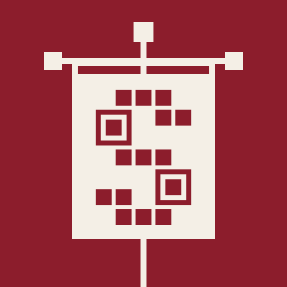
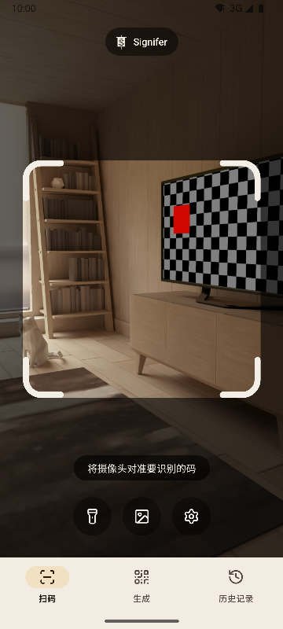
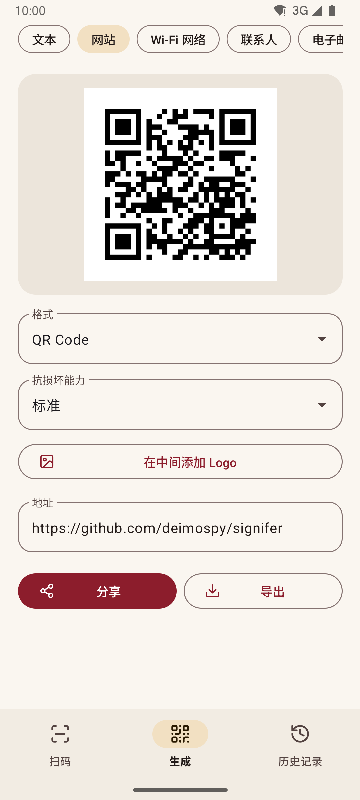
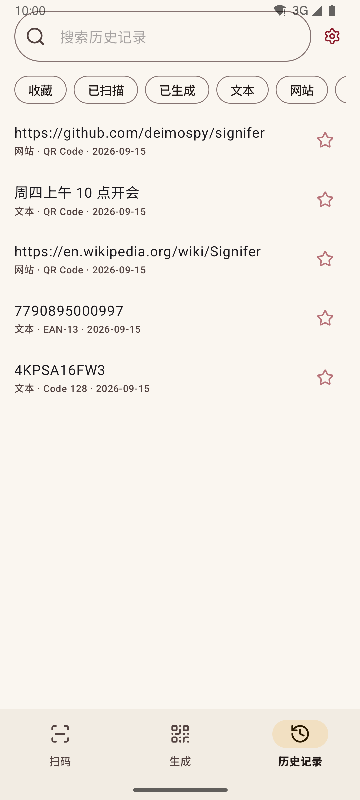
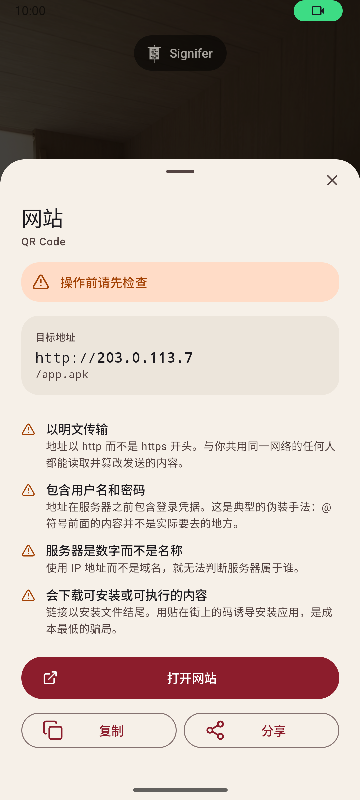

# Signifer

[English](README.md) · [Español](README.es.md) · [Português](README.pt.md) · [Deutsch](README.de.md) · [Français](README.fr.md) · [Italiano](README.it.md) · [Nederlands](README.nl.md) · [Polski](README.pl.md) · [Türkçe](README.tr.md) · [Suomi](README.fi.md) · [日本語](README.ja.md) · [한국어](README.ko.md) · **简体中文** · [繁體中文](README.zh-TW.md)



适用于 Android 的二维码和条形码识别与生成应用。可识别 20 种码，可生成 13 种，并提醒可疑链接。功能齐全，快速轻巧。

*Signifer* 是罗马军团的旗手：手持 **signum** 的人，其他人都追随这个标志。识码器做的也是同一件事：把肉眼无法读懂的标志读出来，展示给你。

| 扫码 | 生成 | 历史记录 | 结果 |
|---|---|---|---|
|  |  |  |  |

## 有何不同

- **打开链接前提醒可疑之处。** 对照封闭列表检查协议，并检查 Punycode 和混用文字、嵌入的登录凭据、私有网络、短链接、安装文件下载以及会反转文字方向的字符。服务器地址按浏览器的方式解析，因此 `2130706433` 会被识别为手机本身。每一项发现都附有解释，而不仅是标上颜色。
- **绝不自行打开任何内容。** 每个操作都需要点按，并在点按的那一刻重新分析目标地址。
- **不联网。** 没有声明 `INTERNET` 权限，系统会阻止一切连接。已在编译后的安装包上验证，详见 [docs/AUDITORIA.md](docs/AUDITORIA.md)。
- **无广告、无付费、无追踪。** 审计会在安装包中查找常见分析和广告 SDK 的痕迹，结果一个都没有。
- **无需存储权限。** 图片通过系统选择器传入，只会交出你选中的那一张。仅需相机和振动两项权限。
- **敏感内容不会自动保存。** Wi-Fi 密码只有在你于结果页面中主动选择保存时才会进入历史记录。
- 基于 Apache-2.0 许可的**开源软件**。

## 扫码

- 只识别取景框内的内容，并用绿色填充识别到的码；画面中有多个码时，也能看出识别的是哪一个。
- 支持细长标签，例如硬盘上的序列号。
- 双指缩放或双击缩放，点按即可对焦。
- 手电筒、从图片识别、可选的振动和提示音。
- 在 225 张高难度图片上测量识别率，详见 [docs/RENDIMIENTO.md](docs/RENDIMIENTO.md)。

## 支持的格式

**识别（20 种）**

矩阵码： `QR_CODE` · `MICRO_QR_CODE` · `RMQR_CODE` · `DATA_MATRIX` · `AZTEC` · `MAXICODE`

零售： `EAN_8` · `EAN_13` · `UPC_A` · `UPC_E` · `DATA_BAR` · `DATA_BAR_EXPANDED` · `DATA_BAR_LIMITED`

工业与物流： `CODE_39` · `CODE_93` · `CODE_128` · `ITF` · `CODABAR` · `PDF_417` · `DX_FILM_EDGE`

**生成（13 种）**

`QR_CODE` · `DATA_MATRIX` · `AZTEC` · `PDF_417` · `CODE_128` · `CODE_39` · `CODE_93` · `EAN_13` · `EAN_8` · `UPC_A` · `UPC_E` · `ITF` · `CODABAR`

九种内容类型：文本、网站、Wi-Fi、联系人（vCard 3.0）、电子邮件、电话、短信、位置和日程（iCalendar）。支持实时预览、在中间添加 Logo（可选），以及导出为 PNG 和 SVG。生成前会根据格式检查内容，对比度不足的码不会导出。

## 支持的语言

英语、西班牙语、葡萄牙语、德语、法语、意大利语、荷兰语、波兰语、土耳其语、芬兰语、日语、韩语、简体中文和繁体中文（台湾）。默认跟随手机语言，也可以在设置中选择其他语言。

## 系统集成

- 快捷设置磁贴，无需打开应用列表即可扫码。
- 图标快捷方式可直达三个页面。
- 响应传统的 ZXing intent：其他应用可以请求扫码，并在不显示界面的情况下获得结果。
- 接收从相册或浏览器分享的图片。

## 构建

需要 JDK 17 和 Android SDK 36。

```
./gradlew :app:assembleRelease
```

每种架构会生成一个安装包，手机只会安装适合自己的那个。

## 检查

```
./gradlew :app:testDebugUnitTest         # 单元测试，无需模拟器
./gradlew :app:lintRelease               # 静态分析，警告视为错误
./gradlew :app:connectedDebugAndroidTest # 设备端测试
python tools/check_purity.py             # 领域层不依赖 Android，且没有不可见字符
python tools/measure.py                  # 对照项目上限检查体积
python tools/audit.py                    # 安装包中的权限与痕迹
python tools/screenshots.py              # 本文档的截图，需要连接模拟器
```

## 文档

技术文档为西班牙语。

| 文档 | 内容 |
|---|---|
| [MEDICIONES.md](docs/MEDICIONES.md) | 每次提交的体积及其变化原因 |
| [RENDIMIENTO.md](docs/RENDIMIENTO.md) | 识别率、耗时和启动 |
| [AUDITORIA.md](docs/AUDITORIA.md) | 发布的安装包里有什么 |
| [DECISIONES.md](docs/DECISIONES.md) | 待定的决策及其结论 |
| [marca/](docs/marca) | SVG 格式的军旗 |

## 支持 Signifer

Signifer 免费、无广告、无追踪。如果它对你有帮助，欢迎支持它的开发：

[](https://github.com/sponsors/deimospy)
[](https://buymeacoffee.com/deimospy)

## 许可证

Apache License 2.0。详见 [LICENSE](LICENSE)。
