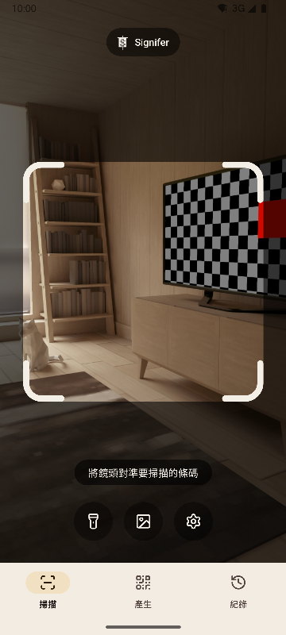
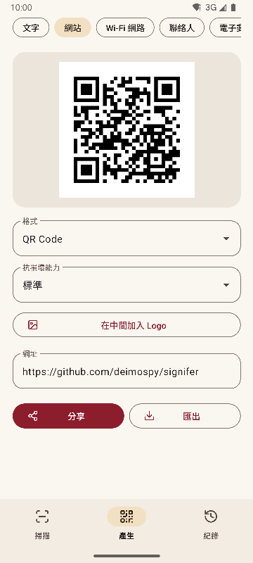
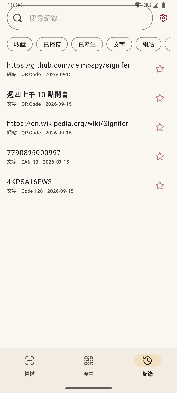
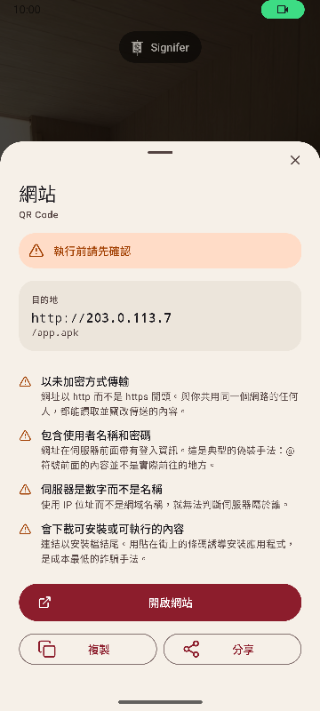

# Signifer

[English](README.md) · [Español](README.es.md) · [Português](README.pt.md) · [Deutsch](README.de.md) · [Français](README.fr.md) · [Italiano](README.it.md) · [Nederlands](README.nl.md) · [Polski](README.pl.md) · [Türkçe](README.tr.md) · [Suomi](README.fi.md) · [日本語](README.ja.md) · [한국어](README.ko.md) · [简体中文](README.zh-CN.md) · **繁體中文**


適用於 Android 的 QR Code 與條碼讀取及產生工具。可讀取 20 種條碼、產生 13 種，並提醒可疑連結。功能齊全，快速輕巧。

*Signifer* 是羅馬軍團的掌旗手：手持 **signum** 的人，其他人都跟隨這個標誌。條碼讀取器做的是同一件事：把肉眼讀不懂的標誌讀出來，展示給你看。

| 掃描 | 產生 | 紀錄 | 結果 |
|---|---|---|---|
|  |  |  |  |

## 有什麼不同

- **開啟連結前提醒可疑之處。** 依照封閉清單檢查通訊協定，並檢查 Punycode 與混用文字、內嵌的登入資訊、私人網路、短網址、安裝檔下載，以及會反轉文字方向的字元。伺服器位址以瀏覽器的方式解析，因此 `2130706433` 會被辨識為手機本身。每一項發現都附有說明，而不只是標上顏色。
- **絕不自行開啟任何內容。** 每個動作都需要點按，並在點按的那一刻重新分析目的地。
- **不連網。** 沒有宣告 `INTERNET` 權限，系統會阻擋一切連線。已在編譯後的安裝包上驗證，詳見 [docs/AUDITORIA.md](docs/AUDITORIA.md)。
- **沒有廣告、付費或追蹤。** 稽核會在安裝包中尋找常見分析與廣告 SDK 的痕跡，結果一個也沒有。
- **不需要儲存空間權限。** 圖片透過系統選擇器傳入，只會交出你選的那一張。只需要相機與震動兩項權限。
- **敏感內容不會自動儲存。** Wi-Fi 密碼只有在你於結果畫面中主動選擇儲存時才會存入紀錄。
- 採用 Apache-2.0 授權的**開放原始碼軟體**。

## 掃描

- 只讀取取景框內的內容，並以綠色填滿讀取到的條碼；畫面中有多個條碼時，也看得出讀的是哪一個。
- 支援細長標籤，例如硬碟上的序號。
- 雙指或點兩下即可縮放，點按畫面即可對焦。
- 手電筒、從圖片讀取、可選的震動與提示音。
- 在 225 張高難度圖片上測量讀取率，詳見 [docs/RENDIMIENTO.md](docs/RENDIMIENTO.md)。

## 支援的格式

**讀取（20 種）**

矩陣式： `QR_CODE` · `MICRO_QR_CODE` · `RMQR_CODE` · `DATA_MATRIX` · `AZTEC` · `MAXICODE`

零售： `EAN_8` · `EAN_13` · `UPC_A` · `UPC_E` · `DATA_BAR` · `DATA_BAR_EXPANDED` · `DATA_BAR_LIMITED`

工業與物流： `CODE_39` · `CODE_93` · `CODE_128` · `ITF` · `CODABAR` · `PDF_417` · `DX_FILM_EDGE`

**產生（13 種）**

`QR_CODE` · `DATA_MATRIX` · `AZTEC` · `PDF_417` · `CODE_128` · `CODE_39` · `CODE_93` · `EAN_13` · `EAN_8` · `UPC_A` · `UPC_E` · `ITF` · `CODABAR`

九種內容類型：文字、網站、Wi-Fi、聯絡人（vCard 3.0）、電子郵件、電話、簡訊、位置與活動（iCalendar）。支援即時預覽、在中間加入 Logo（可選），以及匯出為 PNG 與 SVG。產生前會依格式檢查內容，對比度不足的條碼不會匯出。

## 支援的語言

英文、西班牙文、葡萄牙文、德文、法文、義大利文、荷蘭文、波蘭文、土耳其文、芬蘭文、日文、韓文、簡體中文與繁體中文（台灣）。預設跟隨手機語言，也可以在設定中選擇其他語言。

## 系統整合

- 快速設定圖塊，不必開啟應用程式清單就能掃描。
- 圖示捷徑可直達三個頁面。
- 回應傳統的 ZXing intent：其他應用程式可以要求掃描，並在不顯示介面的情況下取得結果。
- 接收從相簿或瀏覽器分享的圖片。

## 建置

需要 JDK 17 與 Android SDK 36。

```
./gradlew :app:assembleRelease
```

每種架構會產生一個安裝包，手機只會安裝適合自己的那一個。

## 檢查

```
./gradlew :app:testDebugUnitTest         # 單元測試，不需模擬器
./gradlew :app:lintRelease               # 靜態分析，警告視為錯誤
./gradlew :app:connectedDebugAndroidTest # 裝置上的測試
python tools/check_purity.py             # 領域層不依賴 Android，且沒有看不見的字元
python tools/measure.py                  # 對照專案上限檢查大小
python tools/audit.py                    # 安裝包中的權限與痕跡
python tools/screenshots.py              # 本文件的截圖，需要連接模擬器
```

## 文件

技術文件以西班牙文撰寫。

| 文件 | 內容 |
|---|---|
| [MEDICIONES.md](docs/MEDICIONES.md) | 每次提交的大小與變化原因 |
| [RENDIMIENTO.md](docs/RENDIMIENTO.md) | 讀取率、耗時與啟動 |
| [AUDITORIA.md](docs/AUDITORIA.md) | 發布的安裝包裡有什麼 |
| [DECISIONES.md](docs/DECISIONES.md) | 待決事項與最後的決定 |
| [marca/](docs/marca) | SVG 格式的軍旗 |

## 支持 Signifer

Signifer 免費、沒有廣告也不追蹤。如果它對你有幫助，歡迎支持開發：

[](https://github.com/sponsors/deimospy)
[](https://buymeacoffee.com/deimospy)

## 授權

Apache License 2.0。詳見 [LICENSE](LICENSE)。
